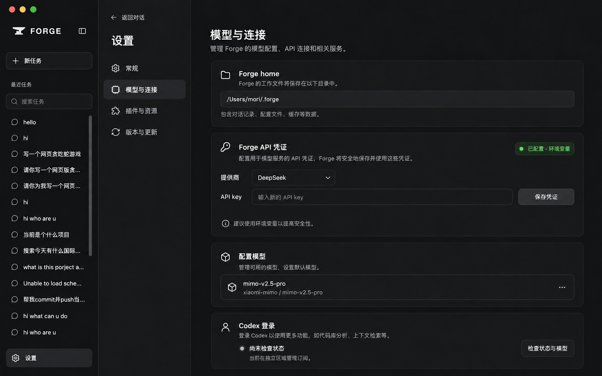
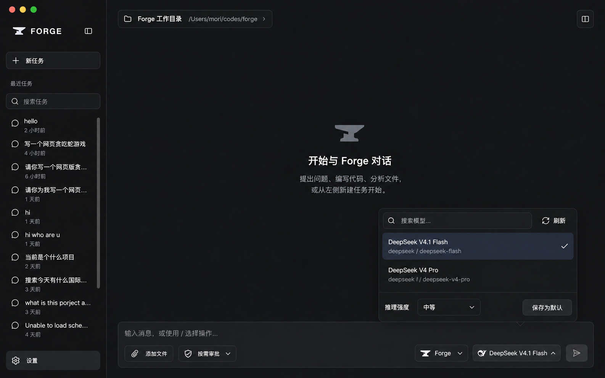
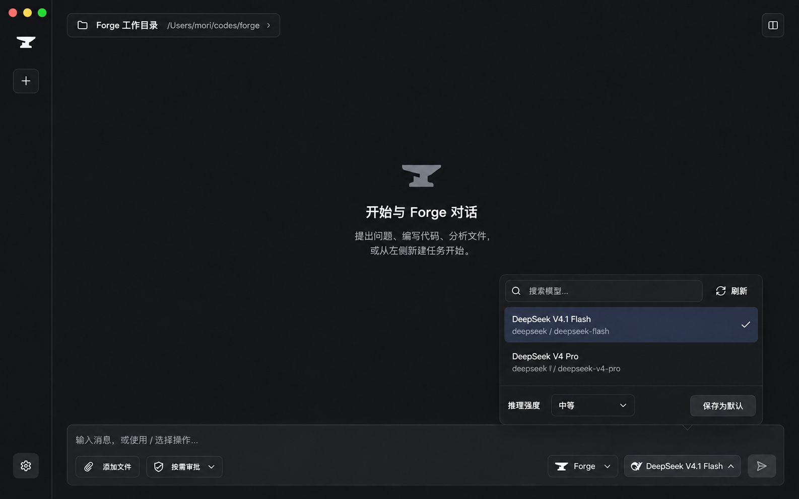
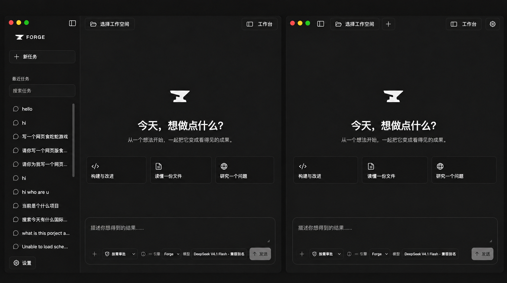

# Forge Desktop 模型与工作台视觉交互改进方案

原方案日期：2026-09-25。macOS 侧栏设计决定：2026-09-26。状态：**设计记录**；下述折叠态修订是拟实施方案，未经验证为已发布行为。原方案中的源码描述是当时的快照，实施前须重新核对。此轮只更新文档。

[English](DESKTOP_REFINEMENT_PLAN.md) · [工作台开发计划](WORKBENCH_DEVELOPMENT_PLAN.zh-CN.md) · [当前桌面产品说明](../../docs/zh-CN/DESKTOP.md)

## 视觉参考（图片生成草案）







**选定的 macOS 侧栏方向（2026-09-26）：**左侧为展开态，右侧为完全折叠态。此图替代较早的窄侧栏构想；它是生成的设计预览，不是应用截图。



这四张图片用于确认视觉方向和布局层级，不是应用截图或可执行原型。图片中的示例状态、辅助文案、任务列表、按钮细节与实际产品数据应以本方案的交互要求和当前源码为准；实现前还需分别检查 Windows 布局、键盘操作和窄窗口。

## 目标与 2026-09-25 基线证据

用户在已安装的 Preview 3 中看到旧 DeepSeek 模型、边框拥挤且不能点击空白处关闭的模型选择器、默认 Electron 应用图标、占据整窗顶部的原生标题栏、粗糙的设置长页，以及无法拖动调宽的任务侧栏。方案基于 2026-09-25 的 `dev` 源码与用户提供的工作台及设置截图；截图只证明该安装包的外观，不证明所有平台的行为。

| 区域 | 2026-09-25 源码快照 | 本方案目标 |
| --- | --- | --- |
| 模型 | `packages/application/src/model-catalog.ts` 内置三个旧 DeepSeek ID；`packages/config/src/schema.ts`、`loader.ts` 和 `packages/model-deepseek/src/config.ts` 默认旧 Flash；adapter 仅允许旧 Vision Exp ID 带图，并仅给旧 ID 配上下文参数 | 将 `deepseek-flash` 作为新选择与新默认，同时保留旧配置、旧会话可用 |
| 选择器 | `apps/desktop/src/renderer/src/model-selector.tsx` 仅通过按钮或 Esc 关闭；`studio.css` 为弹层和每行都绘制边框 | 降低线条密度，支持选择、点击外部、Esc 关闭，保留键盘和焦点语义 |
| 图标 | `forge-mark.svg` 是界面铁砧；`electron-builder.yml` 只指定 Windows `build/icon.ico`，没有 macOS 应用图标 | 同一铁砧视觉生成适合两平台的安装包图标 |
| 窗口 | `src/main/index.ts` 使用默认 `BrowserWindow` 标题栏；真实工作台在 `live-workbench.tsx` 内另有侧栏品牌区 | macOS 让原生红绿灯融入工作台顶部；Windows 保留系统窗口控制 |
| 设置 | `settings-view.tsx` 顺序渲染更新、外观、语言、凭证、模型、插件、联网研究、Codex；`management-settings.tsx` 使用重复卡片与长说明；`studio.css` 将内容限制在窄列 | 清晰导航、状态与操作分组、简短主文案、可展开的详细说明 |
| 任务侧栏 | `studio.css` 固定网格与侧栏宽度，按断点改为 224/190/160 px；`live-workbench.tsx` 只有右侧面板具备拖动状态 | 可拖动、可键盘调整、可折叠且记住展开宽度 |

DeepSeek [2026-09-10 更新日志](https://api-docs.deepseek.com/updates/)与[模型及价格](https://api-docs.deepseek.com/quick_start/pricing/)写明：V4.1 Flash 的 API ID 是 `deepseek-flash`，支持视觉；旧 `deepseek-v4-flash` 和 `deepseek-v4-flash-vision-exp` 暂时转发到它；`deepseek-v4-pro` 继续提供且不支持视觉。接口、能力或转发期限可能变化，实施时需重新核对官方文档。Electron 的[自定义标题栏说明](https://www.electronjs.org/docs/latest/tutorial/custom-title-bar)支持 macOS `hiddenInset` 保留红绿灯，并说明 Windows 需要独立处理控件覆盖区。electron-builder [v26 macOS 配置](https://www.electron.build/v26/docs/mac/)支持应用图标 `.icns`。

## R1：模型目录与运行时兼容

1. 内置推荐列表显示 **DeepSeek V4.1 Flash**（`deepseek-flash`）和仍可用的 **DeepSeek V4 Pro**（`deepseek-v4-pro`）。旧 Flash 与 Vision Exp 不再显示为两款不同的现役模型；已有旧 ID 应继续能被解析、运行和识别为兼容别名。用户已保存的默认配置与历史任务不应被后台悄悄重写。
2. 新安装或未显式指定模型时，统一使用 `deepseek-flash`。同步检查配置默认值、环境变量回退、CLI、桌面目录、适配器上下文表和文档示例，避免界面与实际请求使用不同 ID。已有显式配置保持原值，用户明确选择新模型或保存默认值后才写入新 ID。
3. 为 `deepseek-flash` 开放图片输入前，确认当前 `@ai-sdk/deepseek` Chat Completions 传输能正确编码图像、工具轮次和 continuation；官方[视觉指南](https://api-docs.deepseek.com/guides/vision/)也列出 Responses API 路线。若现有传输不满足，则在 adapter 层补齐并单独验证，不能仅放宽 ID 判断。V4 Pro 仍拒绝图片。
4. 按官方当前参数更新上下文窗口、输出上限和推理强度能力。目录可显示“兼容旧 ID”，但不能把提供商的临时别名当作独立新模型。Codex 模型发现和用户配置的自定义 route 保持各自的数据来源。
5. 先做不花费 API 配额的协议/配置测试；是否进行真实 DeepSeek 文本、图片、工具调用验证，作为单独的明确测试步骤记录。离线通过不写成真实提供商成功。

## R2：模型选择器视觉与交互

建议使用一个清晰的浮层，而不是嵌套的输入框、按钮框和模型卡片框：顶部为搜索与刷新；中间为可滚动的紧凑列表，主行显示模型名，次行显示提供商与 ID；选中项用低对比背景和勾选标记，悬停只改变背景。边框主要用于弹层外缘及必要分区，分隔线不逐行重复。底部将推理强度、临时选择说明和“保存为默认”放在独立区域，保存操作须有明确反馈。

- 点击模型行：更新本次任务的选择并关闭弹层，焦点返回模型触发按钮。重新打开仍可调整推理强度或显式保存默认值；选择本身不写全局配置。
- 点击弹层与触发按钮之外：关闭弹层，不更改已选模型；Esc 同样关闭并恢复焦点。点击触发按钮继续切换开关，不发生关后立即重开。
- 搜索输入、列表行、刷新、推理强度与保存按钮内部点击不能误触外部关闭。异步刷新完成后不意外重开；切换引擎或任务时清理搜索与暂态反馈。
- 支持完整键盘路径、可见焦点、屏幕阅读器名称、忙碌/失败/空结果状态；长模型名可截断，但完整名称可访问。深浅色、中文英文和窄窗口不遮挡输入框或发送按钮。
- `role="dialog"` 的焦点行为与点击外部关闭一致；实现前核查是否需要模态语义或更合适的非模态 popover 语义，避免只改视觉而留下错误的无障碍声明。

## R3：铁砧应用图标

以现有 `forge-mark.svg` 的铁砧轮廓为唯一品牌源，先制作一个可在深浅色 Dock/任务栏上识别的方形应用图标稿：留足边距、明确背景和轮廓对比，并检查 16、32、128、512、1024 px 缩放效果。品牌稿确认后生成 macOS `.icns` 和 Windows `.ico`，在 `electron-builder.yml` 分别显式指定。检查打包后的 `CFBundleIconFile`/Finder/Dock/应用切换器，以及 Windows 安装器、开始菜单、任务栏和窗口图标。Windows 现有 `icon.ico` 的视觉也要复核，不能因文件名存在就判定正确。

图标资源与应用签名是两个独立问题。Preview 3 的 macOS 包未配置 Developer ID 签名和公证；更换图标不会自动解决 Gatekeeper 拦截。未来发布仍需要独立的签名、公证及下载后安装验证。

## R4：按平台处理窗口顶部

**macOS：**保留 Electron 的 `titleBarStyle: "hiddenInset"` 和系统原生红绿灯，不绘制假的红黄绿按钮。选定的展开态中，红绿灯、侧栏开关、工作空间选择器和工作台按钮在同一水平线上；Forge 字标留在侧栏下一行。顶部视觉保持连续，不另加独立的整窗标题横条。顶部空白区可拖动，交互控件不可拖动；全屏、缩放、双击标题区、浅深色和窄窗口均应保留系统预期行为。先用真实 macOS 窗口截图检查坐标，再决定是否需要 `trafficLightPosition` 微调。

**macOS 折叠态（选定方向）：**完全隐藏侧栏，不保留窄栏、铁砧标志、任务列表、底部设置图标或调宽手柄；主内容利用释放的宽度。原生红绿灯保持固定窗口坐标。在红绿灯所在水平线上，从左到右依次放可键盘聚焦的展开侧栏按钮、工作空间选择器和新任务图标，并留出安全间距；工作台和设置放在最右侧。不另加独立的整窗横条或分隔线。重新展开恢复上次展开宽度。系统全屏模式中红绿灯的显隐遵循 macOS 原生行为，不强制绘制替代控件。

**Windows：**本轮保留原生标题栏和系统最小化、最大化、关闭按钮；仅协调标题栏与内容的颜色和品牌图标。不要把 macOS 的左上角安全间距套到 Windows。将来若要统一自绘窗口栏，应单独设计 Windows 的控件覆盖区、系统菜单、拖动、缩放和辅助功能，再决定是否使用 `titleBarOverlay`。

实现时把平台差异放在主进程窗口选项及极少量可信的平台布局状态中；渲染器共享其余工作台。不要因为标题栏设计引入可由网页内容调用的通用窗口管理 IPC。

## R5：设置页重设计

当前设置页在宽窗口中仍被 `max-width: 780px` 限制成一条长列。用户截图里，主题卡片、语言行、连接卡片和凭证卡片之间留白与边框重复，而重要的“已配置”状态、覆盖优先级和危险操作混在说明段落里。新设计沿用黑白铁砧体系，但将**查找设置、查看状态、执行操作**分成清楚的层级。

```text
┌ 设置标题 / 返回对话 ──────────────────────────────────────┐
│ 常规             │ 外观                                  │
│ 模型与连接       │ 主题：浅色  深色  跟随系统            │
│ 插件与资源       │ 语言：简体中文                         │
│ 版本与更新       │                                        │
│                  │ 当前分区的状态行、设置行与操作         │
└──────────────────┴────────────────────────────────────────┘
```

- 在主内容区提供固定可见的分区导航：**常规**（外观、语言）、**模型与连接**（Forge home、API 凭证、已配置模型、Codex）、**插件与资源**（项目插件、Skills 诊断、联网研究）、**版本与更新**。全局任务侧栏仍提供任务切换，设置分区导航只作用于设置页；直接从 `/login`、`/models` 等入口进入时定位并聚焦对应分区。
- 宽窗口采用分区导航加约 640–760 px 正文列，页面标题与返回入口固定在顶部。窄窗口把分区导航变成横向可滚动的标签或原生选择控件，正文单列；避免在任务侧栏之外再挤出一条永久窄栏。
- 每个分区先展示当前状态，再列可修改设置，最后放管理动作。一个分区最多一层外框；设置行之间靠间距或轻分隔线区分，不再将每个说明和按钮都装进独立大卡片。长路径、模型 ID、插件来源等允许换行或复制，但不撑宽页面。
- 把主文案压缩成“此项做什么、当前是什么、操作会改变什么”。环境变量优先、凭证仅保存不验证、插件信任与网络审批的区别、更新包未签名等重要边界保留在对应设置行的简短提示或可展开详情中，不放进泛泛的页首警告。
- 凭证状态使用明确的“来自环境变量 / 本机保存 / 未配置”，密码框继续不回显、不预填，保存和删除反馈就在所属行附近；删除凭证、删除模型、项目插件信任和 Codex 退出仍走已有确认流程。普通主题、语言、通道切换不引入额外确认。
- 版本与更新的当前版本、通道、上次检查、检查按钮和下载/手动安装说明保持在同一分区；检查失败不显示成“已是最新”。联网研究保持“安装”和“启用”两个不同操作，显示实际服务与密钥状态。不能因为重排界面改变这些功能语义。
- 通过语义化标题、导航当前项、表单 label、状态/错误就近提示与聚焦目标保证键盘可达；切换分区和返回对话不清除草稿、会话或临时模型选择。检查中英文、深浅色、长路径、空列表、错误、加载及 720 px 最小窗口。

## R6：任务侧栏拖动调宽

使用网格列宽的单一状态作为布局来源，去掉 `.app-frame` 网格宽度与 `.sidebar` 自身宽度不一致的固定值。展开侧栏默认约 224 px；拖动边界时即时更新，宽度限制为约 160–360 px，同时保证主内容至少约 520 px。窗口缩小时只临时夹紧显示宽度，不覆写用户保存的偏好；扩大后恢复偏好宽度。macOS 选定的折叠态不保留侧栏列，原生红绿灯的命中区由主内容顶部控件布局避让；Windows 保留原生标题栏，其折叠布局另行检查，不直接套用 macOS 间距。重新展开恢复上次展开宽度。

- 在侧栏右边界提供细微可见的拖动提示和足够宽的命中区域；仅从手柄开始拖动，不抢侧栏条目的点击与文本选择。使用 Pointer Events 与 pointer capture，并在释放、取消、失焦或组件卸载时清理。
- 手柄可由键盘聚焦，具备分隔条语义、当前值与最小/最大值；左右方向键按固定步长调整，Home/End 到边界，双击手柄恢复默认宽度。显示清晰的焦点状态，不把可拖动性只交给鼠标用户。
- 只将展开宽度保存在本机 UI 偏好中，不写入 Forge 模型配置或会话；设置页、普通会话与右侧工作台共用同一宽度。窄窗口右侧工作台堆叠时仍保证主内容与输入框可用；与现有右侧面板拖动手柄互不争夺 pointer capture。
- macOS 顶部红绿灯方案须在最小、最大展开宽度及完全隐藏侧栏时检查；红绿灯不能与开关、工作空间、新任务或拖动区冲突。Windows 原生标题栏布局独立检查。
- 增加展开→折叠→展开的真实窗口截图和点击验收：三颗红绿灯保持固定且可点击；顶行开关能恢复侧栏；新任务、设置、工作空间和工作台仍可访问；主内容利用释放的宽度。在最小窗口、全屏和设置页重复检查。

## 实施顺序与验收

| 阶段 | 交付与必要验证 |
| --- | --- |
| 1. 模型 | 同步配置/目录/适配器/文档；旧 ID 与历史选择回归、文本/图片/工具/强度协议测试；记录是否执行了真实提供商调用 |
| 2. 选择器 | 视觉与点击外部/选择关闭/焦点/键盘测试；中英文、浅深色、窄窗口截图检查 |
| 3. 图标 | 品牌稿确认、两平台资源与打包配置；检查安装包和已安装应用的原生图标，而非仅看网页内 SVG |
| 4. 窗口 | macOS 原生红绿灯在展开/折叠、拖动及全屏下验收；Windows 原生控件和布局回归；平台截图分别记录 |
| 5. 设置 | 四分区导航与状态/操作层级；验证现有管理语义、直接定位、确认框、反馈、中英文/深浅色及窄窗口 |
| 6. 侧栏 | 拖动、键盘调宽、边界夹紧、折叠恢复、窗口缩放、持久化及右侧面板并存测试 |

实施后按仓库要求运行相关测试、`CI=true pnpm check`、文档检查，以及因打包资源变化所需的 `CI=true pnpm package:verify`。安装包外观与 Gatekeeper 只能用实际下载/安装包验证；不能由源码检查或渲染器截图代替。发布需另行决定版本、签名、公证与平台覆盖。

## 确认点

macOS 折叠侧栏方向已于 2026-09-26 选定，实施与验收仍未完成。原方案的其他确认点包括：以 `deepseek-flash` 为新默认、旧 ID 保持兼容；选择模型后关闭弹层；设置页四分区导航；任务侧栏支持拖动、键盘调整和记住宽度。其实施状态须以当前源码重新核对，不能把这份日期已定的方案当作产品证据。
