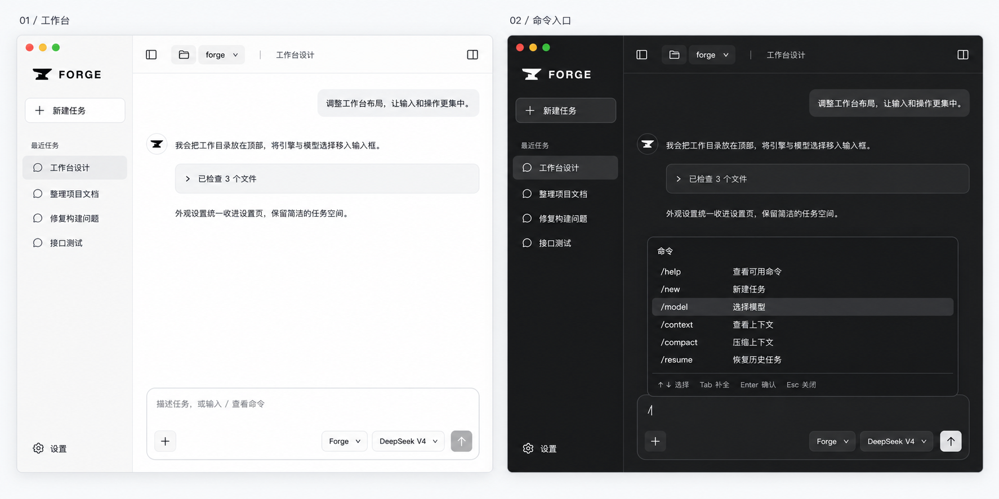
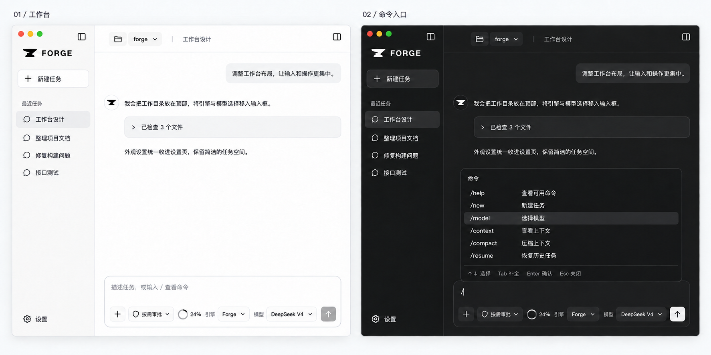
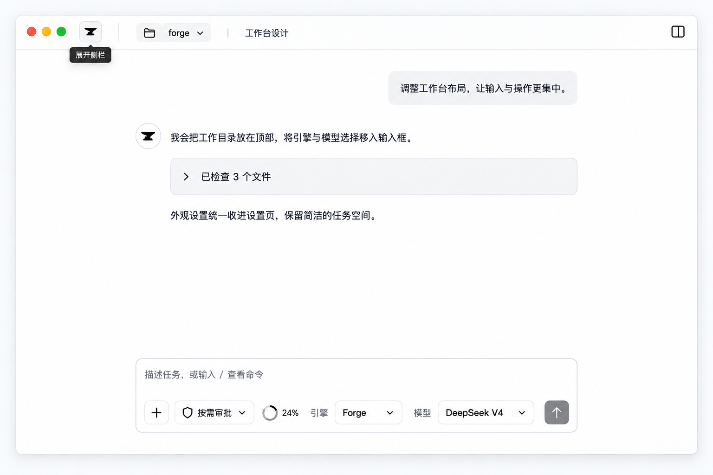
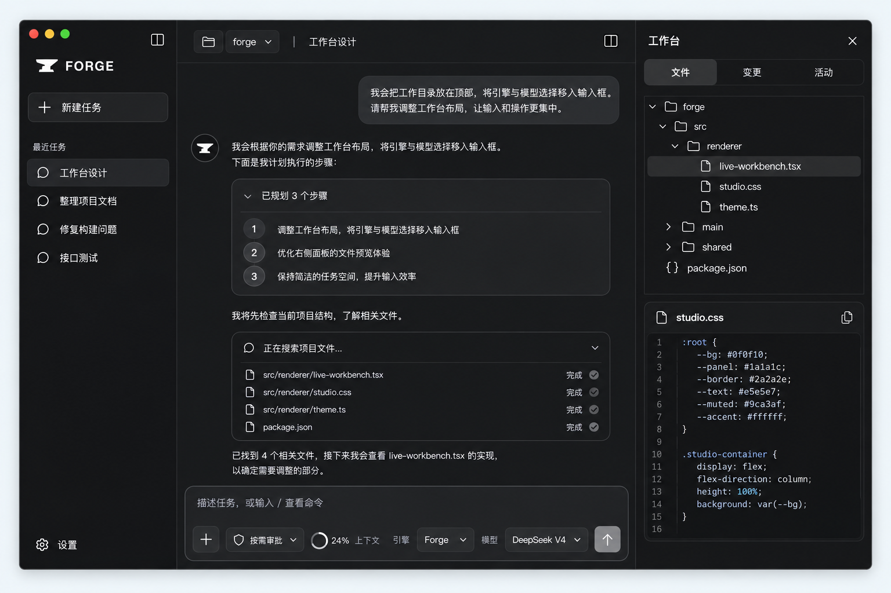
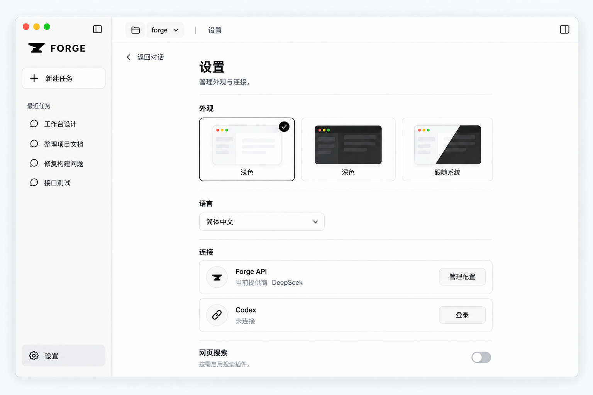
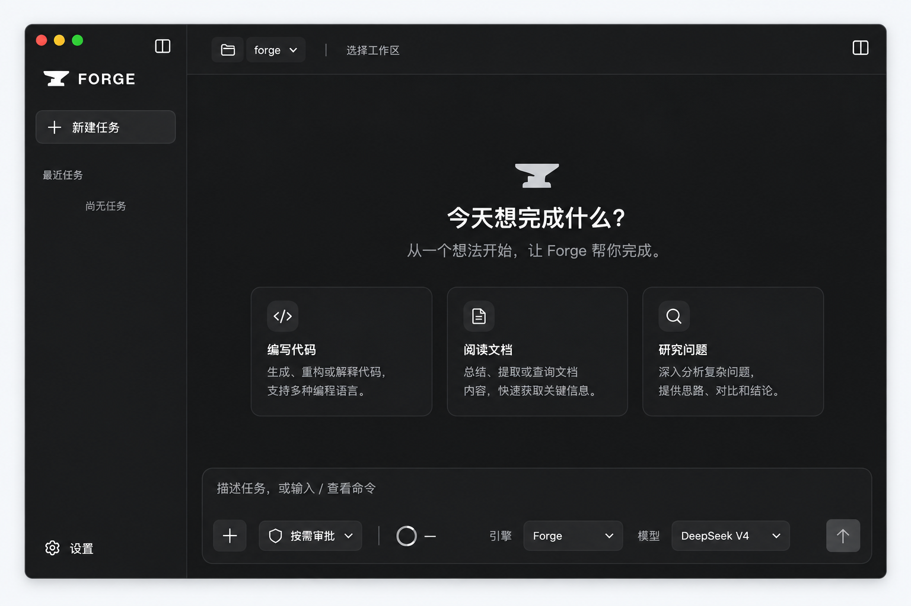

# 桌面工作台布局与斜杠命令设计

状态：待用户确认，未实施。2026-09-15。

本方案承接已经实现的黑白主题与铁砧品牌，描述下一轮布局和交互改造。
当前产品行为仍以源代码为准；本文不是已交付能力说明。
英文版：[Workbench UX plan](WORKBENCH_UX_PLAN.md)。

## 视觉基准与修订图

以下图片已保存在仓库中，Markdown 预览可直接显示，不依赖临时目录。
原图的浅色工作台与深色命令菜单均保留在同一张对照图中。

### 原始参考（保留视觉语言）



### 最新修订（当前视觉基准）



仅变更三处：折叠按钮移入侧栏右上角；加号旁新增当前权限选择；引擎/模型前新增提示文本，引擎左侧新增上下文用量圆环。
保留原图的消息气泡、圆形铁砧头像、工具卡片、侧栏图标、选中行、按钮边框、圆角、间距和深浅层次。
右上角工作台面板入口也必须保留，不与侧栏折叠按钮混淆。

**此前 Figma 稿过度简化，仅作结构草稿，不作为视觉验收标准。** 后续 Figma 精修与代码实现均应对照最新修订图逐项还原，不得只移动控件却丢失原设计。
图中的 24% 和“按需审批”为示例状态；实际显示由上下文预算和权限策略决定。
这些图片是设计参考，不代表产品功能已实现。优先保持原设计；图片中偶发文字细节以本文明确的“引擎”“模型”标签规范为准。

## 1. 目标与参考

让用户主要面对任务内容：顶部回答“在哪里工作”，底部回答“输入什么、用哪个引擎和模型执行”。
删除 `FORGE / research · Ready` 横幅；模型和引擎移入输入框，工作目录移到顶部，外观设置只保留在 Settings。
桌面端沿用 TUI 的斜杠命令名称和语义，并提供键盘可操作的命令菜单。

参考证据：

- 用户提供的 Codex 截图：任务/工作区在顶部，模型在输入框底部，侧栏底部提供设置入口。
- 本机 ZCode 实际交互：在原本为空的输入框键入 `/`，出现上浮的“命令与能力”列表，包含命令及技能分组；检查后删除 `/`，没有发送消息或执行命令。
- ZCode 顶部展示任务、目录和分支，输入框底部集中放置模式、模型和推理强度。
- 只借鉴信息位置和渐进展开的交互，不复制其自动化、订阅、远程控制等产品功能。

## 2. 当前代码与差距

| 位置 | 当前职责 | 本轮调整 |
| --- | --- | --- |
| `src/renderer/src/live-workbench.tsx` | 横幅、侧栏、顶部模型字段、输入框、设置、面板 | 拆分顶部工作区栏、输入控制、命令菜单 |
| `src/renderer/src/studio.css` | 黑白主题与工作台布局 | 去横幅占位，收紧顶部，适配输入控件与菜单 |
| `src/renderer/src/theme.ts` | 主题持久化和系统主题监听 | 复用；只移除侧栏入口 |
| `src/shared/application-protocol.ts` | 状态、工作区、会话、压缩及部分管理 IPC | 增加缺失的命令请求及结构化结果 |
| `src/agent/application.ts` | 管理操作及持久会话 | 在同一管理边界接入命令服务 |
| `src/shared/run-protocol.ts` | 运行请求，已有 engine/model | 补齐经过验证的推理强度等必要字段 |
| `apps/cli/src/commands.ts`（仓库根目录起） | TUI 命令目录 | 提取中立目录，避免两端各维护一份 |
| `apps/cli/src/interactive/app.tsx`（仓库根目录起） | TUI 命令执行和选择器 | 作为语义依据，提取服务，不引入 Ink 到桌面端 |

目前桌面端已有恢复、压缩、Codex 登录及有限的 web 插件设置。
这不等于已有完整的提供商登录/退出、插件管理、权限撤销和资源诊断能力。
TUI 当前目录有 **16 个命令**，应全部纳入兼容清单。

## 3. 页面布局

```text
┌──────────────┬────────────────────────────────────────┐
│ 铁砧 FORGE    │ 侧栏开关  文件夹 / 当前目录   任务标题   面板 │
│ 新建任务      ├────────────────────────────────────────┤
│ 最近任务      │                                        │
│ …            │              对话内容                   │
│              │                                        │
│              │     ┌ 命令菜单（输入 / 时出现） ┐        │
│              │     ┌ 输入框 ─────────────────┐        │
│              │     │ 描述任务或输入 /          │        │
│ 设置          │     │ ＋   Forge ▾ 模型 ▾ …  ↑ │        │
└──────────────┴─────┴─────────────────────────┴────────┘
```

### 顶部工作区栏

- 完全删除品牌/路径/Ready 横幅及其高度占位，不留下第二层空条。
- 保留一条约 48–56 px 的工具栏，左侧依次为目录按钮及可用的任务标题；右侧为工作台面板开关。
- 目录按钮显示短名称，悬停及键盘聚焦可查看完整路径。没有目录时显示“选择工作区”或当前自动工作区状态。
- 点击目录复用原生目录选择流程；取消不改变会话、目录或草稿。
- 运行中禁止更换目录，显示原因；切换成功后按现有边界清理文件预览和变更基线视图。
- 任务名截断，路径和右侧操作不能挤出窗口。不添加尚无服务支持的 Git 分支选择器。
- 不再常驻显示 Ready。运行、停止中和审批状态放在输入框/审批区，失败在相关操作附近显示。
- 检查 Electron 原生标题栏、交通灯和拖动区域：只移除渲染器横幅，不误删系统窗口控制。

### 输入框

- 上方是自适应高度的多行文本区，下方为紧凑控件行。
- 左侧 `＋` 提供已有“添加文件副本”能力；说明这是导入副本，不暗示直接修改外部原文件。
- 右侧依次放引擎、模型、可用时的推理强度、发送/停止按钮。
- 显示 `引擎 Forge ▾`、`模型 模型名 ▾`，选择器前保留简短提示文本和可访问名称。
- 模型选择器支持搜索、当前选择、加载/失败/空列表状态。Native 与 Codex 使用各自配置及发现结果。
- 自定义模型只在原有配置允许时提供，不把 Codex 模型混入 Native 列表。
- 切换引擎保留草稿，重置不兼容的模型/强度选择；不触发登录，不创建任务，不自动提交。
- 推理强度必须来自提供商/模型支持信息，不能用统一静态列表假定全部模型支持。
- 普通输入保留 Command/Ctrl+Enter 发送、Enter 换行；输入法组字期间不提交或选中命令。
- 运行中显示停止按钮并锁定执行配置，保留草稿编辑；停止请求尚未完成时显示“停止中”。
- 引擎差异说明放入设置连接区或选择器辅助说明，不在每条输入框下重复展开项。

### Settings 和响应式

- 外观只在 Settings 中提供浅色、深色、跟随系统；保留本地记忆和系统实时监听。
- 侧栏底部仅保留设置入口，折叠后也必须有可访问的设置入口。
- 设置页可以返回会话，退出设置不丢草稿，也不改变引擎选择。
- 1100 px 宽窗口保持侧栏、主内容和按需面板；840 px 宽沿用覆盖式工作台。
- 输入控件优先缩短模型名称；不足时将底部控制分成两行，不能挤压发送按钮或产生横向滚动。
- 深浅色都使用现有中性主题令牌；错误、警告、审批与差异继续使用必要的语义色。

## 4. 斜杠命令交互

### 触发和键盘

- 草稿开头的 `/` 触发菜单；段落内部的 `/`、URL 和代码块不触发。
- 菜单位于输入框上方，与输入框等宽，最多约 320 px 高，其余内部滚动。
- 每项显示名称、简短中文/英文说明和必要的可用性提示。输入过滤命令名称。
- 上下键移动；Tab 补全命令并保留输入焦点；Enter 在菜单打开时选择，Esc 关闭。
- 无参数动作选中后执行；带参数/子操作的命令进入对应选择器，不立即提交不完整操作。
- `/compact --dry-run`、`/effort <level>` 等既有参数形式按 TUI 解析规则兼容；其他参数先核对 TUI，再决定是否为桌面扩展。
- 未知或非法命令显示本地错误并保留草稿，绝不调用模型。提供明确的“作为普通消息发送”操作处理以 `/` 开头的普通内容。
- 成功后清除命令草稿，失败时保留；重复提交在 pending 状态被阻止。
- 菜单采用可访问的 combobox/listbox 关系，暴露当前选项，键盘移动保持选中项可见；关闭后恢复输入焦点。
- 命令结果属于本地系统反馈，不伪装成模型回答，不无条件写入模型对话上下文。

### 兼容矩阵

| 命令 | 桌面目标行为 | 依赖与验收要点 |
| --- | --- | --- |
| `/help` | 显示可搜索的命令说明与兼容状态 | 与 TUI 共用目录 |
| `/new` | 新建空白会话，旧会话可恢复 | 同步清除会话授权；不只清空 UI |
| `/clear` | 清空当前上下文，保留磁盘历史 | TUI 不额外清除 approvalStore；与 `/new` 分开实现和测试 |
| `/context` | 打开上下文状态面板 | 复用真实状态，不按渲染文本猜 token |
| `/permissions` | 查看并撤销会话授权 | 核心策略服务；撤销必须真实生效 |
| `/update-dismiss` | 忽略当前提示版本 | 桌面无对应更新提示时说明不适用，不伪造成功 |
| `/compact` | 压缩并显示结果，支持 `--dry-run` | 延续会话锁、修订冲突检查；不删除规范历史 |
| `/plugins` | 项目插件列表、状态与管理界面 | 现有 web 设置只是子集；复用安装/启用/信任边界 |
| `/resources` | Skills 与资源诊断视图 | 只读发现不等于授权执行技能 |
| `/login` | 提供商/引擎选择及登录流程 | 不能一律映射成 Codex 登录；凭证不回传渲染器 |
| `/logout` | 选择提供商并退出 | 不误清除另一引擎登录状态 |
| `/model` | 打开输入框模型选择器 | 与点击选择器使用同一份状态与数据 |
| `/delete-model` | 删除配置中的模型 | 选择明确对象并确认，复用配置写入服务 |
| `/effort` | 选择或设置支持的推理强度 | 复用模型元数据、TUI 校验与持久化语义 |
| `/resume` | 搜索并恢复当前工作区历史 | 检查边界与冲突，重置瞬时上下文和授权 |
| `/exit` | 走 Electron 正常窗口关闭流程 | 活动运行遵循现有退出处理，不强杀 Agent |

运行期间允许 `/help` 等只读界面操作；切换会话、压缩、配置修改、权限变更等按服务是否允许决定可用性。
禁止仅在渲染器禁用按钮：主进程/Agent 同样验证活动状态。
对于暂未接入的命令，菜单标明“尚未接入”，解释原因；不能以跳转 Settings 冒充功能完成。

技能条目是后续增强：先完成 16 个命令的语义兼容，再考虑显示已发现的 Skills。
不因为参考软件有 `/plan`、`/goal` 就添加 Forge 尚未具备的模式。

## 5. 实现结构

1. 提取无 React、Ink、Electron 依赖的命令目录和参数解析到私有共享应用层；CLI 继续通过原入口导出，保持现有调用兼容。
2. 命令描述包含名称、参数规则、说明键、平台适用性；授权与运行状态判断不由静态目录决定。
3. 渲染器拆分 `WorkspaceHeader`、`ComposerControls`、`SlashCommandMenu`，不继续堆积全部处理在 `LiveWorkbench`。
4. 命令路由返回三类结果：打开界面、调用管理服务、本地说明/错误；普通消息是独立运行入口。
5. 主进程校验 IPC，Agent/共享应用层处理会话、配置、插件和认证。复用持久化、锁与冲突检测，不让渲染器访问文件系统或密钥。
6. 新增结构化模型能力与命令结果 DTO；对 schema、preload、Agent、渲染器及测试同步变更。
7. `/new` 和 `/clear` 必须重置后端活动会话。只把前端 sessionId 设为空可能被下一次 state 刷新恢复，不能作为最终实现。
8. 配置命令复用 TUI 的写入语义；任务级临时选择与持久默认值在界面中明确区分，避免两端默认值漂移。

## 6. 实施顺序与交付门槛

- A：布局调整。去横幅，目录上移，引擎/模型下移，外观收进 Settings，保留原行为。
- B：命令基础设施和现有能力。共享目录、解析、键盘菜单；完成 help/new/clear/context/compact/model/resume，补齐真实后端重置。
- C：管理能力兼容。permissions/plugins/resources/login/logout/delete-model/effort；接入共享服务和选择器，保持凭证与授权边界。
- D：平台适配。exit/update-dismiss，异常反馈、无障碍、中英文和视觉回归。

分步用于降低回归风险，不代表只完成 A/B 就宣称全部兼容。最终逐项记录矩阵中的支持、平台不适用和未完成项。
进入代码阶段前由用户确认本文；本轮只提交文档改动到工作区，不提交 Git commit。

## 7. 验收

- 单元测试：共享命令目录一致、参数合法/非法、未知命令、路径/URL/代码输入、参数大小写规则；命令输入不会进入模型调用路径。
- 组件/集成测试：IME、Tab/Enter/Esc、上下滚动、焦点、pending 防重复、失败保留草稿、切换任务草稿隔离。
- 会话测试：new/clear 的授权差异、后端重置、resume 边界、compact dry-run 无写入与修订冲突。
- 管理测试：模型/强度验证，Native/Codex 凭证隔离、插件信任、授权撤销、失败不伪报成功。
- UI 矩阵：中英 × 深浅 × 首页/会话/设置/命令菜单 × 展开/折叠；另测 840 px 窄窗口与长模型名称。
- 检查顶部无横幅残留，目录可取消选择，输入框控件可操作，Settings 外无主题开关，发送/停止一直可见。
- 运行聚焦 Vitest、`CI=true pnpm check`、`CI=true pnpm check:docs`、桌面构建和 Electron 离线 UI 验收。
- 共享服务影响跨层运行合约时增加确定性评估；涉及打包资源时增加 package:verify。认证真实调用与安装包验收另行记录，不用离线结果替代。

## 8. 推荐决策

建议采用上述布局并以完整命令矩阵为兼容目标。优先复用业务服务，保留 TUI 名称及参数规则；
桌面呈现为选择器和面板，平台不适用项明确说明。保持本轮黑白品牌，不再进行新一轮 Logo 设计。

## 9. 设计修订：侧栏与输入控制（2026-09-15）

本节覆盖前面示意图中侧栏开关和输入控件位置；仍为设计方案，未实施。

- 展开时折叠按钮位于侧栏内部右上角，与品牌行对齐；主内容顶部不重复放折叠按钮。
- 折叠后主内容左上角显示方形铁砧展开入口，提供“展开侧栏”提示和可访问名称。
- 输入框底行顺序：`＋  当前权限 ▾`，弹性间隔，`上下文圆环  引擎 Forge ▾  模型 DeepSeek V4 ▾  发送`。
- 权限按钮展示真实当前权限状态；不能将参考软件“自动编辑”直接当成 Forge 默认授权。示意稿使用“按需审批”，最终文案应映射现有策略。
- 点击权限按钮展示策略、会话授权和撤销入口；切换涉及授权变化时复用现有审批规则，不因 UI 选择绕过审批。
- 上下文圆环位于引擎左侧，表示已用比例。悬停/聚焦显示已用、总预算及剩余比例；点击打开上下文详情。
- 用量未知时显示中性空环和“用量暂不可用”，不能显示伪造的 0%。设计稿中的百分比仅为样例。
- 引擎、模型前分别显示“引擎”“模型”标签；窄窗口换行，不省略权限和发送入口。
- Figma 交付为可编辑设计参考，含主工作台与命令菜单状态。仅展示用于说明交互的样例内容，不作为已实现功能证据。

Figma: [Forge — Workbench UX v2](https://www.figma.com/design/sk9IZlKqoRF8PEpAJ3gR8b).

## 补充场景参考图

以下四张图延续最新修订图的视觉语言，属于设计参考，尚未实现。文字规范与真实状态优先于图片中的示例数据或生成误差。

### 左侧栏收起



完整收起任务导航，通过左上角方形铁砧重新展开；对话和输入框保持居中阅读宽度。

### 右侧工作台展开



右侧提供文件、变更、活动标签及关闭入口，输入框仅占中间对话列。文件树选中项与预览标题在实现时必须一致；图中代码、目录和对话仅为示例。

### 设置界面



设置页集中展示外观、语言和连接，隐藏输入框与右侧工作台，提供返回对话入口。网页搜索开关不能替代安装与配置流程，实际可用性仍由插件状态决定。

### 无对话的新任务首页



保留铁砧、引导文字和三个建议入口，点击只填写草稿。上下文未知显示空环和破折号，不伪报 0%。未选择目录时顶部只显示选择工作区，不显示示例 forge 目录。
