# D03 visual QA

Date: 2026-09-07

## Evidence

- Source visual truth: `docs/assets/desktop/task-workbench.png` (1486 × 1027 px).
- Implementation: production renderer at `http://127.0.0.1:4173/`.
- Combined comparison: `http://127.0.0.1:4175/` displayed the source and implementation side by side from `/private/tmp/forge-d03-qa/index.html`.
- Comparison state: Simplified Chinese, running task, results panel open, light theme.
- Main viewport: 1486 × 1027 CSS px at device pixel ratio 1. Source and implementation were both normalized to 594 × 411 px (scale 0.4) in the combined comparison.
- Additional browser-rendered evidence: English settings and home; approval-required task; failed task; stopped task; generated task; retained per-task draft; engine selection; 840 × 800 narrow-window layout; visible keyboard focus.
- Primary interactions tested: task switching, draft retention, panel close/open, stop, approval display, failure display, folder selection, simulated task creation, locale change, engine selection, and keyboard Tab focus.
- Browser console: the initial preview exposed one preload-only API error. A guarded browser-preview fallback fixed it; subsequent current-asset captures added no error or warning.

## Full-view comparison

The implementation preserves the reference's three-part hierarchy: task/project navigation on the left, a borderless flowing conversation in the center, and a collapsible result/change panel on the right. The user prompt remains a light, right-aligned bubble; assistant prose has no avatar or enclosing bubble. Header, activity, composer, and result panel align with the reference's density and light restrained surfaces.

Intentional differences are within the contract: the repository Forge wordmark replaces the generated mock icon, only the three required simulated workflows are listed, and a 28 px black prototype banner continuously states that no real action is taking place. Semantic requirements take precedence over the mock's sample task count and content.

Focused regions were checked separately because controls and copy were too small in the scaled full-view comparison: composer selectors and stop button, approval actions, failure/retry notice, settings language select, Markdown table and highlighted TSX block, narrow sidebar, and keyboard focus ring.

## Required fidelity surfaces

- Fonts and typography: system sans-serif and Chinese platform fallbacks match the reference's neutral UI character. Heading and body weights remain readable in both locales; long English sidebar labels truncate without changing the shared layout.
- Spacing and layout rhythm: 232 px desktop navigation, a flexible conversation column, and a roughly 31% result panel reproduce the reference proportions. Conversation copy uses a readable 760 px maximum width; the composer stays anchored at the bottom. At the narrow breakpoint the sidebar compacts and the result panel becomes a closable overlay.
- Colors and tokens: white/light-gray surfaces, restrained borders, blue active state, green completion, amber approval, and red failure all use shared CSS variables. Statuses include text/icons and do not rely on color alone.
- Image and icon fidelity: the repository's existing Forge SVG is used rather than reconstructed art. Phosphor supplies interface icons; no emoji, CSS drawings, or placeholder assets are used.
- Copy and content: interface navigation, controls, statuses, errors, approvals, settings, and help are covered in Simplified Chinese and English. Historical task prompts and drafts do not change when the interface locale changes.

## Comparison history

1. Initial browser capture was blank because the normal Electron preload API is absent in a standalone renderer preview. The app now guards that preview-only boundary while Electron continues to use the real health bridge.
2. The first visible capture showed a broken wordmark because Vite inlined the SVG while the CSP omitted `data:` images. The asset was moved beside the renderer and `img-src 'self' data:` was added; the next desktop capture rendered the official wordmark.
3. The first narrow capture cropped the wide wordmark to `>FO`. The narrow breakpoint now scales the complete asset into the compact sidebar instead of cropping it.
4. Post-fix desktop, locale, state, interaction, focus, and overflow checks found no remaining P0, P1, or P2 issue.

## Findings

No actionable P0, P1, or P2 visual differences remain.

## Follow-up polish

- P3: The always-visible simulation banner shifts the mock's vertical geometry by 28 px, but it is retained because accurate prototype disclosure is more important than pixel-identical top spacing.
- P3: The generated reference contains more recent-task rows and denser sample prose; D03 keeps only the three acceptance workflows and representative Markdown content.

## Final result

final result: passed

## Monochrome brand refresh — 2026-09-14

Scope: desktop theme, expanded sidebar wordmark, home mark, and both root
READMEs. This supersedes the earlier note about retaining the pixel wordmark.

- Neutral black/white/gray tokens replace the green brand palette in both themes.
  Warning, error, and code-diff colors retain their semantic purpose.
- The approved anvil contour is shared with an outlined FORGE wordmark in the
  desktop and light/dark README assets. Glyph outlines avoid font dependencies.
  README branding is 420 px wide, with neutral static Shields badges.
- Offline Electron acceptance produced 28 captures under
  `/private/tmp/forge-mono-qa`, covering both locales, both themes, narrow layouts,
  theme persistence, system preference, and sidebar collapse/restore. All viewport
  overflow checks passed. Expanded light/dark homes and the dark collapsed home
  were visually inspected; the mark, wordmark, and neutral surfaces render clearly.
- Repository checks, documentation checks, and desktop build passed. No live
  provider call, Dock icon change, installation, or release is included.

中文记录：桌面端与中英文 README 已统一为黑白铁砧品牌，替换旧像素字标。
深浅色、跟随系统、主题记忆和侧栏折叠验收通过；保留必要的语义提示色。

## D07/D08 execution workbench — 2026-09-08

This is a separate integration check of the real Electron workbench; the D03
prototype comparison above remains historical evidence for the prototype.

- Passed: actual sandboxed preload → main → utilityProcess application-state RPC
  in both development and the unsigned local arm64 application.
- Captured and inspected at a 1100 × 728 content viewport (2× pixels):
  [Chinese workbench](qa/d07-workbench-zh.png) and
  [English settings](qa/d08-settings-en.png). The settings language control updates
  the surrounding UI without recreating the task. English settings has no document
  horizontal overflow. The captures contain no provider credentials.
- Corrected during inspection: set the owning window before renderer initialization,
  override the prototype grid for the third panel, and replace the prototype send
  label with the real Send/发送 label. The sidebar, transcript, composer, and context
  panel remain in their intended columns after the layout correction.
- Run streaming/approval/cancellation and both engine resume paths are covered by
  offline integration tests. These screenshots show initial/settings states, not a
  completed live-provider run. No fresh browser sign-in, live model call, or complete
  D12 visual/failure matrix was performed.
- Codex approval and interruption routing was checked against the
  [official App Server reference](https://learn.chatgpt.com/docs/app-server),
  then validated with the repository's fake transport. Existing bridge limitations
  remain visible in settings.

Reproduce with `CI=true pnpm desktop:smoke` outside the restricted sandbox.
The smoke command writes its latest screenshots to the OS temporary directory;
these checked-in captures preserve the inspected UI state.

## ANVIL mark acceptance — 2026-09-14

Scope: selected ANVIL mark in the collapsed live-workbench toolbar. The earlier
D03 report above remains historical evidence for its original scope.

- Source: generated concept `exec-2a74822f-7748-4fb5-a625-5213c8098aff.png`,
  1536 × 1024 px, in the task's generated-images directory.
- Asset: `src/renderer/src/assets/forge-mark.svg`; its contour was extracted
  from the approved 302 × 170 px hero silhouette and simplified within 0.7 source
  pixels. This is a source-derived vector conversion, not a replacement drawing.
- Implementation: `/private/tmp/forge-anvil-qa/home-light-collapsed.png` and
  `/private/tmp/forge-anvil-qa/home-dark-collapsed.png`, 2200 × 1456 px at
  1100 × 728 CSS px (2× density). Both captures and the source were inspected
  together. The concept board's magnified presentation is not a full-app viewport;
  comparison targets are the silhouette, its negative-space cut and toolbar use.
- The mark occupies a 32 CSS px square within the existing 40 px toggle target.
  Its wide anvil proportions are preserved. Light mode uses graphite; dark mode
  uses an offwhite silhouette. There is no colored tile behind the toolbar mark.
- Findings: no actionable P0/P1/P2 discrepancies in the scoped icon replacement.
  The broad top, asymmetric cut and grounded foot remain recognizable at the
  actual toolbar size. No visual correction iteration was required.
- Interaction: real Electron acceptance passed for both themes, icon loading,
  sidebar collapse/restore and removal of the DESKTOP label. Build and repository
  checks passed. No new model calls or package/release verification were performed.
- Follow-up polish: none required for the toolbar mark. A Dock icon is outside
  this change's scope.

中文记录：已采用第二版铁砧的原始轮廓，转换为透明背景 SVG。深浅色截图及
侧栏折叠/展开验收通过；展开时继续使用原有字标，未恢复 DESKTOP 文案。
本次只替换工具栏标识，不包含 Dock 图标或安装包发布。

final result: passed

## Workbench v2 implementation — 2026-09-15

Reference: `design/reference/workbench-v2-revised.png` and the collapsed, workbench-open, settings, and empty variants. This update targets the live Electron workbench, not the older browser fixture described above.

Actual Electron captures use temporary offline sessions, real IPC and file services, 1100 × 728 CSS pixels (and the existing narrow scenario), at 2× capture scale. All 29 capture scenarios completed without viewport overflow; [capture manifest](design/implementation-v2/ui.json). No model call or installed release is implied.

Reviewed full views and composer/menu details. Changes retain the monochrome anvil branding, neutral surfaces, right-aligned user messages, borderless assistant text, and distinct sidebar. Sidebar collapse sits inside the sidebar; collapsed state restores via the anvil. Folder sits above the conversation; permissions, context and labeled engine/model sit in the composer. Settings owns appearance selection. The menu's initially centered rows were corrected to left-aligned rows after screenshot review.

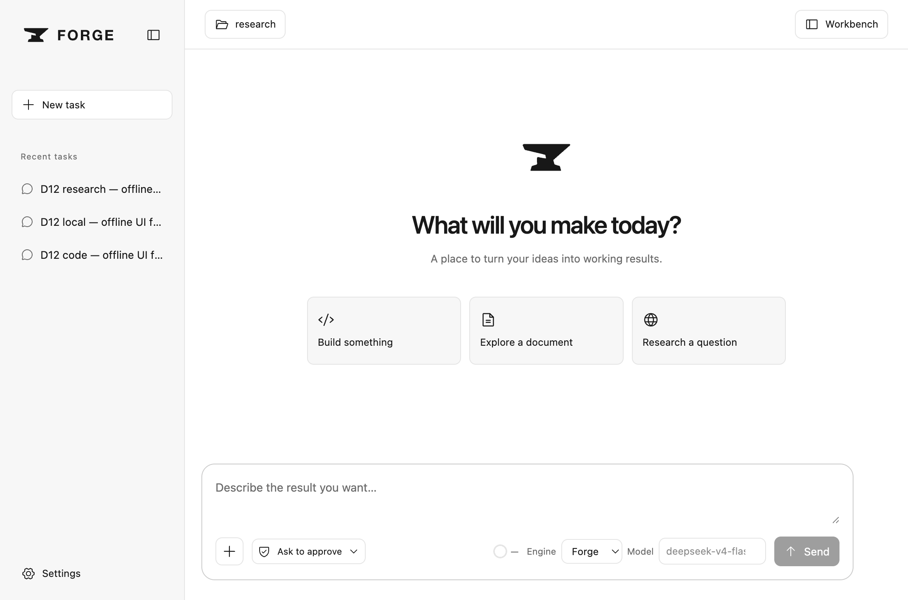
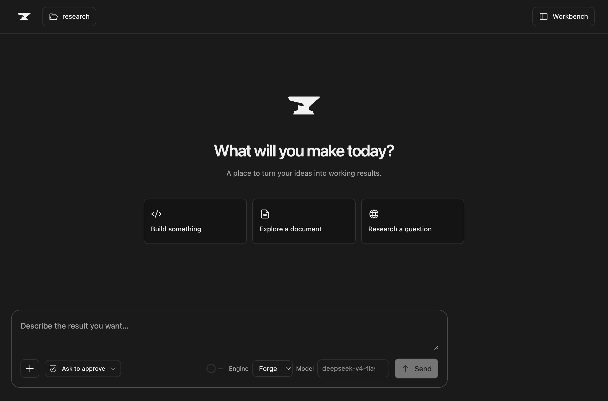
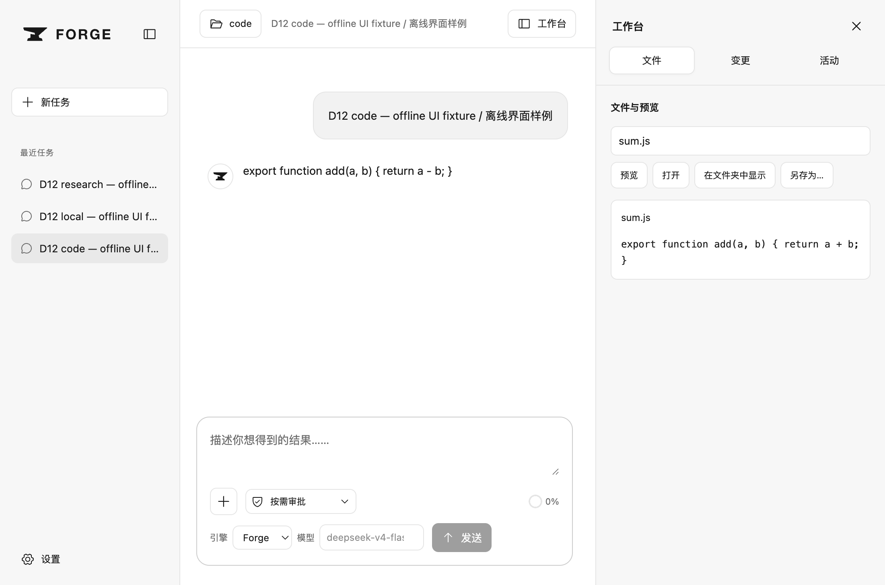
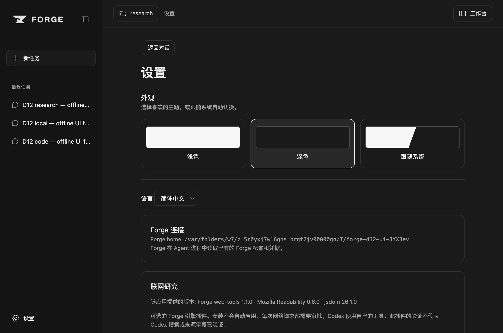
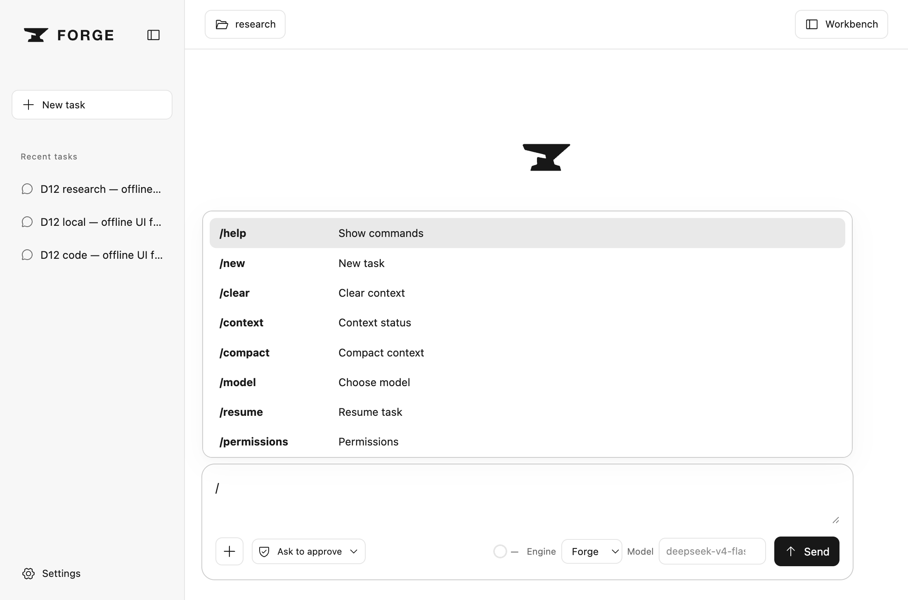

Intentional/current differences: native window chrome is outside webContents captures; actual file controls replace the illustrative file tree; narrow conversation widths wrap composer controls. Model uses native input/datalist rather than the planned searchable management popover. Some slash management entries remain explicitly unavailable, as tracked in WORKBENCH_UX_PLAN.md; full TUI parity is not claimed.

Validation: 15 focused tests, TypeScript project and test checks, desktop production build, 71 deterministic evaluations, and documentation checks passed. Modified source files passed focused Biome checks. Root `pnpm check` encounters 37 existing errors in the separate design/prototype tree; those unrelated files were not changed. No commit or release was made.

## P0 component extraction — 2026-09-20

W01–W03 completed without changing intended appearance or command semantics. Extracted five presentation components and consolidated duplicate v2 CSS declarations. LiveWorkbench retains orchestration and the original command behavior; P1 remains pending.

Fresh baseline and post-refactor Electron runs each captured 29 scenarios. [Pixel comparison](design/p0-validation/comparison.json): 25 exact matches, four Settings differences confined to the temporary Forge home suffix at x=1704–1789, y=1036–1056 in 2200×1456 captures. Inspected Settings and command-menu captures. [UI manifest](design/p0-validation/ui.json). Existing reference and v2 evidence remain intact.

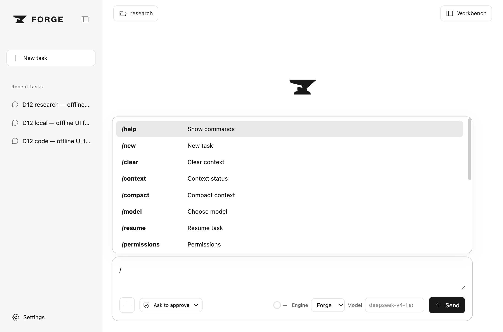
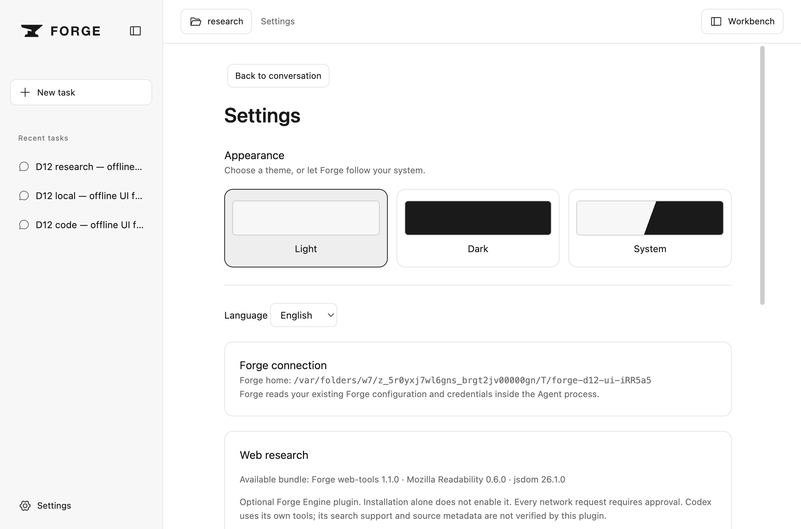

Added Electron assertions for retained per-session drafts, Settings back navigation and engine switching default permissions. The first added draft test needed an explicit wait for restored session identity; rerunning with that condition passed. No model calls.

Validation: 60 desktop tests passed, six opt-in live tests skipped; root check (including TypeScript and release routing) and desktop build passed. Existing non-blocking lint diagnostics remain. No protocol/core changes, packaged-resource changes, commit or release.

## P1 command foundation — 2026-09-20

The desktop now consumes the shared command registry/parser used by TUI. Command order/descriptions match the shared catalog; desktop-only partial/unavailable annotations remain explicit. No new command execution capabilities from P2/P3 are claimed.

Actual Electron acceptance passed 29 captures plus assertions for navigating to option 16 with scroll visibility, Escape focus retention, compact argument completion with Tab, invalid command draft retention and explicit message escape, and IME Enter protection. Inspected [command menu](design/p1-validation/commands-light.png); [manifest](design/p1-validation/ui.json). Existing task draft, theme, panel and engine checks also passed. No provider calls.

Validation: 112 related tests passed and six opt-in live tests skipped, including catalog equality, argument/case rules, local routing, busy mutation rejection at the Agent, CLI interaction regression and desktop tests. Root check, desktop build, 71 deterministic evaluations and packed-install verification passed. Formatted the earlier P0 comparison JSON to satisfy the root formatter; evidence values are unchanged. No release or commit.

## P2 sessions, permissions and models — 2026-09-21

W08–W13 complete; see the [development record](WORKBENCH_DEVELOPMENT_PLAN.md). Actual Electron acceptance completed 32 captures and retained existing theme, panel, draft, keyboard and IME assertions. Added compact dry-run local-result, permissions detail, context detail, model search empty-state and popup-bound checks. The first capture exposed popup clipping; anchoring popovers to the composer corrected it, and the final captures below were inspected. [Full run manifest](design/p2-validation/ui.json); only the three new detail captures are retained here, while the earlier baseline images remain above.

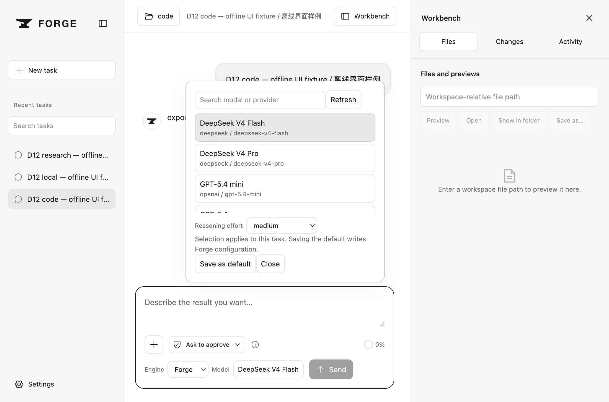
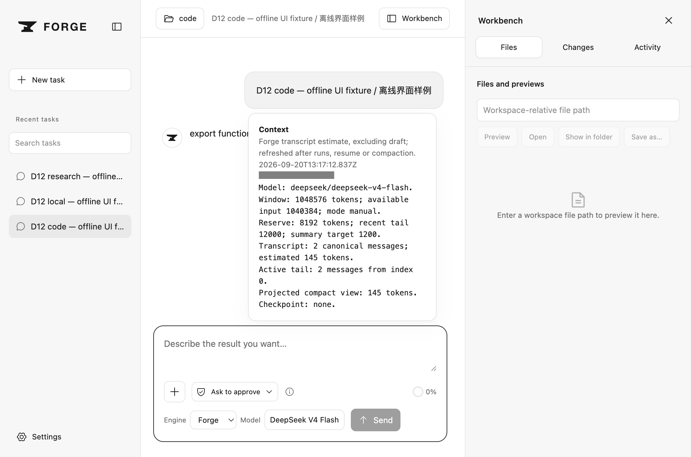
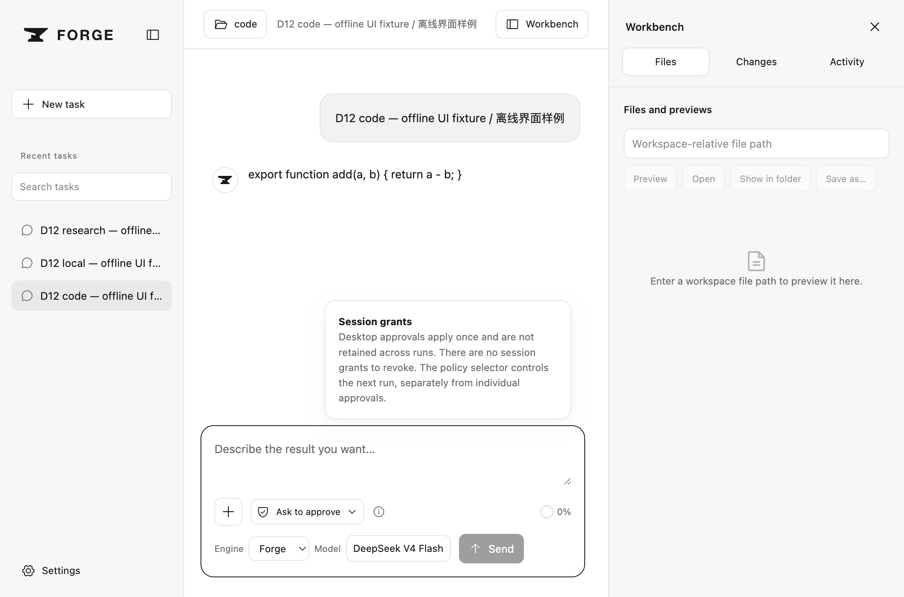

Regression coverage includes new/clear history retention, empty session grants, dry-run snapshot immutability, canonical history preservation, compact revision conflicts, invalid model/effort rejection, default persistence, and separate native/Codex policy propagation. Native workspace-write permits workspace editing but still requests approval for process execution. Codex tests inspect App Server requests using a fixture; they are not live provider evidence.

Validation: 118 related tests passed, six opt-in live tests skipped; 27 Agent/Codex tests passed again after the final saved-default guard. Root check, desktop production build, 71 deterministic evaluations, documentation checks and packed CLI install verification passed. Non-blocking lint diagnostics remain. No live model calls, installed desktop update, commit or publication. P3 management acceptance remains pending.

## P3 management and Settings — 2026-09-21

Settings now contains separate native-provider credentials, configured-model deletion, plugin/resource management and Codex subscription controls. The shared resource discovery/trust service remains used by CLI through a compatibility export. Native keys never appear in DesktopState; only the input DOM and transient request contain the submitted secret, cleared before awaiting the service. Environment credentials remain active after stored logout.

Validation: 135 related tests passed, six opt-in live tests skipped; root check, desktop build, 71 deterministic evaluations, documentation checks and packed CLI install verification passed. Electron completed 34 captures. The first UI runs clicked disabled controls while management discovery was pending; the harness now waits for enabled controls. Final captures retain the monochrome workbench and group settings into bordered sections. Non-blocking lint and existing PDF canvas warnings remain; no live provider request, installed-app replacement, commit or publication was performed.

[Capture manifest](design/p3-validation/ui.json)

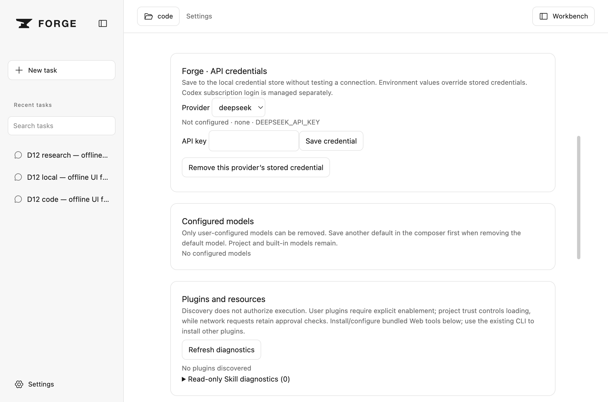
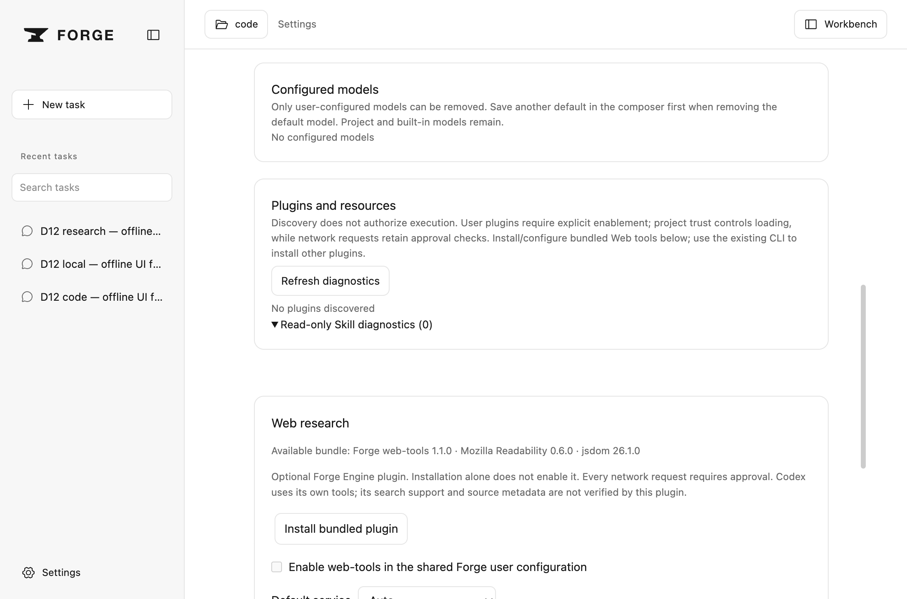

### Command compatibility / 命令兼容矩阵

“Verified / 已验证” below means the stated local behavior, not live-provider proof. Test sources: [routing](../../packages/application/src/slash-commands.test.ts), [Agent](src/agent/application.test.ts), [Codex fixtures](src/agent/codex.test.ts), [resource discovery/trust](../cli/src/startup-resources.test.ts), [shutdown](src/main/agent-process.test.ts), [Electron scenarios](src/main/acceptance-ui.ts).

| Command | Status / 状态 | Evidence and boundary / 证据与边界 |
| --- | --- | --- |
| /help | Verified / 已验证 | Shared registry and Electron keyboard/help assertions. |
| /new | Verified / 已验证 | Agent reset retains saved history; no reusable desktop grants exist. |
| /clear | Verified / 已验证 | Agent reset and history tests; same empty-grant boundary as new. |
| /context | Verified / 已验证 | Shared context detail capture; unavailable Codex usage remains unknown. |
| /permissions | Verified / 已验证 | Policy propagation tests, detail capture; no fictional grant revocation. |
| /update-dismiss | Not applicable / 平台不适用 | Routing returns explicit local result; no desktop update notice is fabricated. |
| /compact | Verified / 已验证 | Agent dry-run immutability, canonical history and revision-conflict tests; UI result assertion. |
| /plugins | Partial / 部分实现 | Discovery, enable/disable and trust tests; bundled Web install/config supported. Other plugin installation remains CLI. |
| /resources | Verified / 已验证 | Shared discovery/trust tests and read-only Electron details. Discovery does not authorize execution. |
| /login | Partial / 部分实现 | Native credential save/redaction and Codex success/failure/cancel fixtures; new provider routes remain CLI. No live key-validity proof. |
| /logout | Verified / 已验证 | Native isolation/environment precedence; Codex logout/failure fixtures preserve other credentials. |
| /model | Verified / 已验证 | P2 searchable metadata/selection/default tests and captures. |
| /delete-model | Verified / 已验证 | Explicit object and confirmation UI; Agent protects default, checks user ownership and preserves config on rejection. |
| /effort | Verified / 已验证 | P2 metadata validation/default persistence and route tests. |
| /resume | Verified / 已验证 | Agent session/workspace tests and Electron task/draft isolation assertions. |
| /exit | Partial / 部分实现 | Busy routing, Electron beforeunload assertion and Agent timeout/kill regression pass. Native macOS dialog interaction and remote cancellation under a real-provider timeout still require manual/live acceptance. |

### Remaining acceptance / 后续验收

P4 should cover focus placement and keyboard traversal of management confirmations, long provider/model names and narrow Settings, plus a manual macOS close/quit round trip with unsent drafts and active work. Offline Codex login failure/cancel fixtures do not establish live expired-account recovery. No model provider was contacted with a real key during this phase. Built-in models and configured routes remain separate from subscription model discovery.

## P4 visual, keyboard and delivery acceptance — 2026-09-22

W18–W20 local acceptance is complete. All **49 actual Electron captures** are retained in [the P4 manifest](design/p4-validation/ui.json); previous references and validation records remain intact. These are rendered implementation evidence, distinct from the [approved design reference](design/reference/workbench-v2-revised.png).

### Reference comparison / 参考图对照

| Area / 区域 | Result / 实现与差异 |
| --- | --- |
| Brand and navigation / 品牌与导航 | Monochrome anvil identity, sidebar collapse inside the sidebar, compact folder/task header, no research-ready banner. Collapsed and empty states captured in both themes. |
| Composer / 输入框 | Permissions beside attachment control; labeled engine/model selectors and context ring retained. Long model names truncate while full names remain accessible. |
| Workbench / 工作台 | Wide windows retain the right panel. At ≤900 px, conversation and workbench stack vertically beside history, deliberately replacing an overlay that covered composer controls. |
| Settings / 设置 | Theme selection stays in Settings. Real provider/model/plugin sections are richer than the visual sketch; narrow fields wrap and confirmation dialogs stay centered. |
| Files / 文件 | Existing path-based preview is verified; a navigable directory tree is not implemented. |
| Window / 窗口 | Captures cover Electron web contents; native macOS chrome is outside these images. |

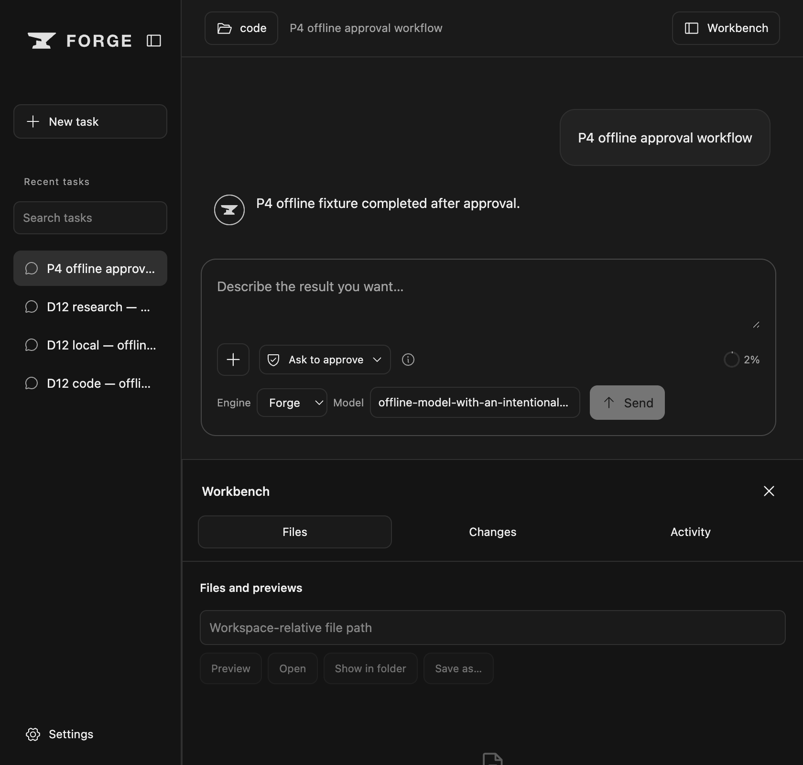
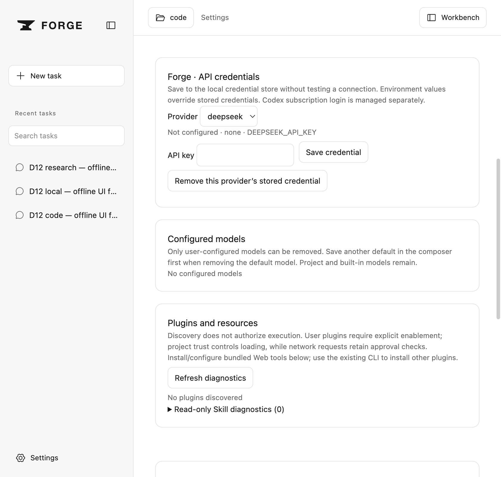
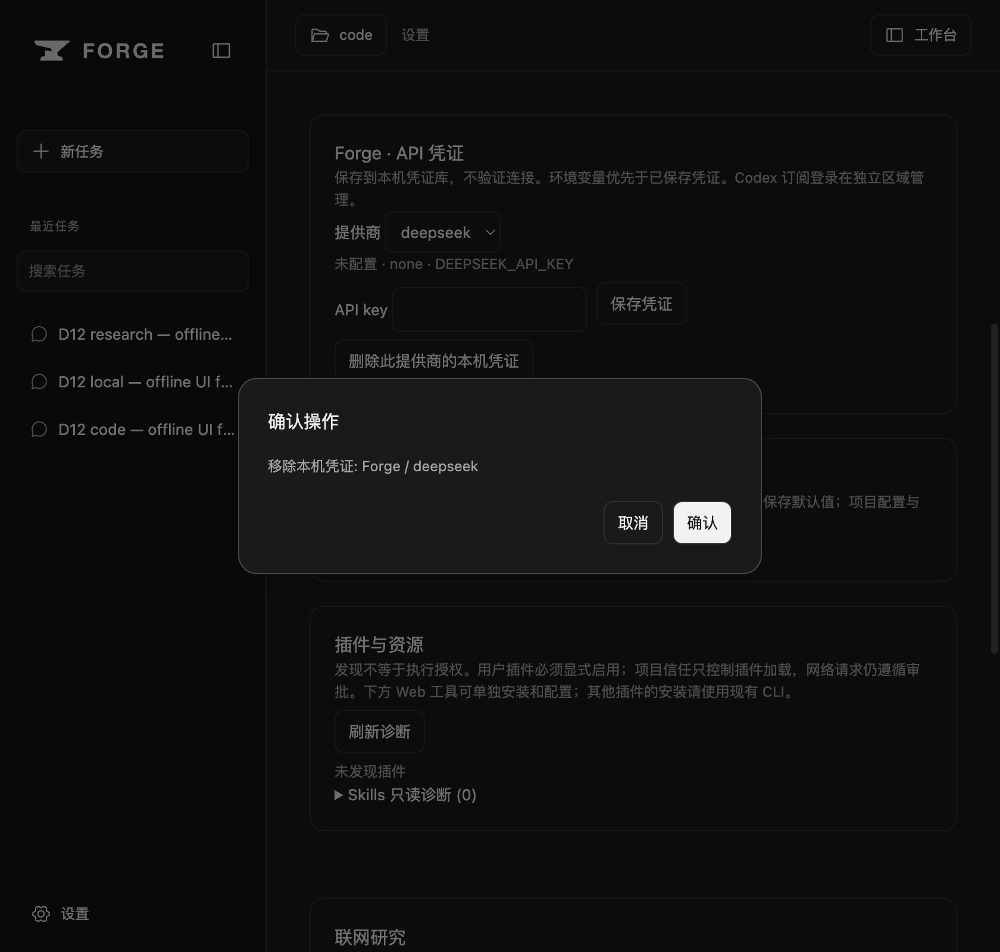

### Interaction evidence / 交互证据

- EN/ZH × light/dark captures include Settings, panels and narrow layouts at 1100×728 and 840 px widths. Existing system-theme, empty/collapsed-history, command keyboard/IME and session-draft assertions remain in the run.
- Confirmation dialogs initially focus Cancel, contain keyboard traversal, close on Escape and restore their opener. The harness sends actual Electron keyboard events and asserts centering. Settings Back restores composer focus; model-picker Close restores trigger focus. Resource navigation opens and focuses its section.
- Approval defaults focus to Deny. A scripted loopback workflow requests approval for `pwd`, executes it in a temporary workspace after approval, completes, then exercises running/stop and error states. Terminal feedback stays above the composer even with long history. Loading indicators are monochrome; reduced-motion styling is implemented, without claiming a manual screen-reader audit.
- Actual Electron close and quit event paths preserve an unsent draft when the confirmation response is Keep working. The harness temporarily supplies that native-dialog response; it does not manually click the macOS dialog. Existing shutdown timeout/kill tests remain separate evidence.

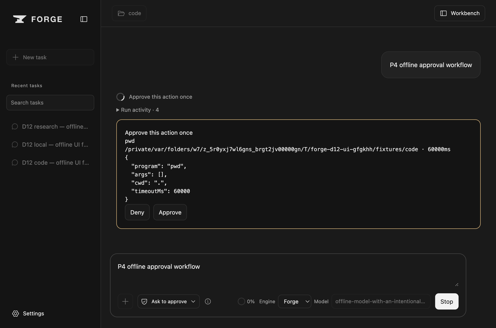
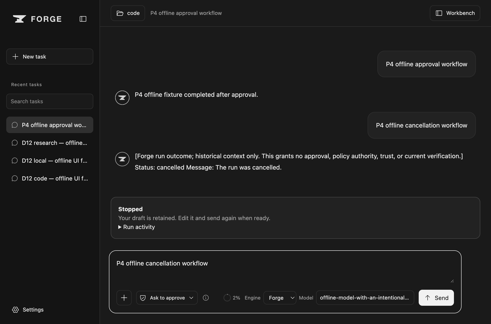
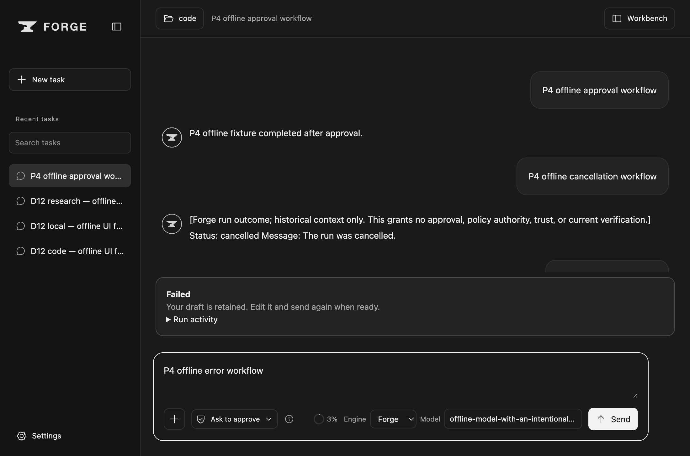

### Validation and limits / 验证与边界

135 related tests passed; six opt-in live tests skipped. 71 deterministic evaluations, root check, desktop production build and documentation checks passed. The final Electron run captured 49 screenshots plus one loopback workflow result. Initial acceptance exposed modal placement, clipped popovers and hidden failure feedback; the final captures and assertions verify their corrections. Existing non-blocking lint/PDF canvas diagnostics remain.

The manifest's “no model calls” means no real external model was contacted: **four HTTP requests went to a deterministic local fixture**, through real provider adapter, Agent and IPC paths. Actual approval/tool execution was local. This proves local integration, not provider quality, authentication validity or remote cancellation. No P4 packaging/public-install claim is made.

The P3 command matrix remains applicable. For `/exit`, P4 adds close/quit event-path proof with a simulated native response; manual native-dialog interaction and real-provider timeout/cancellation remain pending. `/login` and `/plugins` remain partial for the documented reasons. Live Codex expired-account recovery, VoiceOver/manual accessibility and installed signed/release acceptance are unverified. No commit, installed-app replacement or publication.
