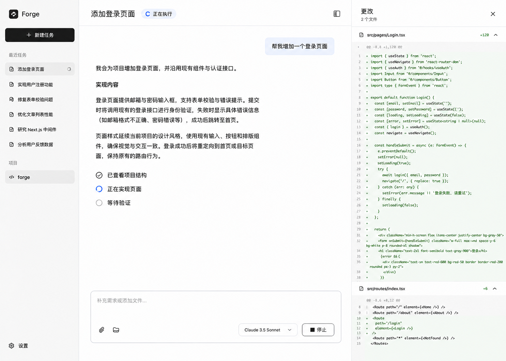

# Forge desktop design and implementation contract

[简体中文](zh-CN/DESKTOP_APP_PLAN.md) · [Documentation](README.md)

[Development task checklist](DESKTOP_APP_TASKS.md)

## Status and use

Product decisions and coding-agent handoff recorded on 2026-09-06. This is
`current-development`, not shipped behavior or packaged product help. Source
inspection used checkout `4a41f93`; recheck current source and tests before work.
This document does not establish that desktop, document, or research features exist.

Read repository `AGENTS.md`, this contract, [Architecture](ARCHITECTURE.md),
[Sessions](SESSIONS.md), [Security](SECURITY_MODEL.md), and relevant source first.
Implement settled requirements without repeatedly asking for approval. Resolve
explicitly open decisions at the relevant stage. This contract does not authorize
publication, uploading user files, enabling external accounts, or rewriting the TUI.

## 1. Product goal and scope

Forge should offer a clear, usable desktop AI assistant for code projects and daily
work. The first version need not replace a mature product or become the user's
preferred daily application.

Three complete workflows share one workbench without mandatory mode selection:

| Workflow | Experience | Deliverable |
| --- | --- | --- |
| Code changes | Open folder → describe → change and verify → review differences | Real code, differences, verification results |
| Local files and documents | Add files/folder → read, organize, or generate → preview and open | Real files in the working directory |
| Research | Question or links → investigate and analyze → sourced report | Report file with inspectable sources |

Initial formats and research scope are settled in section 5; concrete dependencies
and versions require compatibility checks, and actual service behavior requires verification. Search
integration is settled in section 5. Unsupported operations
must be identified rather than simulated as successful. Email, calendars, cloud
drives, plugin marketplaces, cloud execution, device synchronization, background
daemons, parallel task orchestration, and TUI/desktop execution handoff are outside
this first-version contract.

## 2. Current source baseline

| Fact | Source | Desktop implication |
| --- | --- | --- |
| CLI enters Ink using `process.cwd()` | [session.ts](../apps/cli/src/session.ts) | Follow the actual entrypoint, not the older readline implementation |
| Canonical working directory; nearest ancestor `.git` becomes root, otherwise starting directory | [loader.ts](../packages/config/src/loader.ts) | Distinguish current directory from workspace boundary |
| Relative tool paths resolve against cwd and canonical paths are checked against root | [path.ts](../packages/tools/src/path.ts) | Preserve path and symlink checks |
| TUI submission connects events, approvals, and cancellation to execution | [app.tsx](../apps/cli/src/interactive/app.tsx) | Consume structured interfaces, not terminal strings |
| `runTask` assembles configuration, instructions, models, tools, plugins, policy, then calls `runAgent` | [run.ts](../apps/cli/src/run.ts) | Share assembly instead of copying it |
| Core owns the model/tool loop, policy, events, and outcomes | [runtime.ts](../packages/core/src/runtime.ts) | Do not rebuild the loop in UI |
| Session service prepares and records runs, lists and restores workspace history | [persistent-session.ts](../apps/cli/src/persistent-session.ts) | UI task maps to Session |
| Forge home stores `sessions/` and `runs/` | [session-store.ts](../packages/persistence/src/session-store.ts), [trace-store.ts](../packages/persistence/src/trace-store.ts) | Reuse validated persistence |
| Built-ins list, read, search, edit, and execute commands | [registry.ts](../packages/tools/src/registry.ts) | General document previews and research need additional capabilities |

Native Forge and Codex engines have distinct execution branches. Preserve both
existing TUI paths during extraction; the first desktop version will support both
engines. Do not attribute one engine's tools or events to another. Source inspection
is not regression-test or live-provider evidence.

## 3. Settled directory and data model

### Concepts

A workspace is a real Git or ordinary folder. A visible task is an existing
Session. Each submission creates a bounded Run in that Session. Deliverables are
ordinary working files, referenced by history rather than duplicated in an artifact store.

Do not introduce a parallel persistent task execution entity, mandatory
`task.json`, `inputs/`, or `outputs/`. Add minimal navigation metadata for titles,
recency, or favorites only if needed; never duplicate canonical history.

### Directory rules

| Scenario | Rule |
| --- | --- |
| TUI | Preserve current cwd/root resolution |
| Desktop folder selection | Feed the selected directory through the same resolution |
| New task within a project | Inherit its workspace and explicit working directory |
| Independent task without a folder | Create `$FORGE_HOME/workspaces/<id>/` as an ordinary working directory |
| Generated or edited files | Use normal tool paths directly within the workspace, with no mandatory output subfolder |
| Save as | Export a copy to the chosen destination; preserve original files and history references |

Forge home defaults to `~/.forge`; respect `FORGE_HOME`. GUI startup may not inherit
terminal environment overrides: verify and expose the effective location rather
than assuming both clients use the same custom path. Prefer creating automatic
directories on first valid submission, not merely on visiting the home screen.

Starting in `/projects/site/src` with `/projects/site/.git` yields
`cwd=/projects/site/src`, `root=/projects/site`; `login.ts` resolves from cwd.
Do not imply that selecting a repository subfolder restricts the whole workspace
to it. Show repository scope when necessary.

Configuration, sessions, and traces remain in Forge home; project files stay in
their projects. An automatic directory must itself be the workspace boundary,
never all of Forge home. Verify compatibility with existing protection rules;
resolve conflicts narrowly without weakening credential/configuration/history protection.

### Sessions and recovery

Storage was settled on 2026-09-06: retain existing **JSON session snapshots,
JSONL run traces, and ordinary files in working directories**, with no database
in the first version. Desktop and TUI share persistence implementation, format
validation, redaction, and atomic saves. Do not create a separate incompatible
desktop session store.

Reuse session schemas and ordered run records. New task creates a Session;
continuation restores history and starts a new Run. Never resume unfinished tools,
processes, provider continuations, or approval authority from history.

Do not implement an execution takeover protocol or promise live synchronization.
Shared storage still needs a minimal conflict check or busy rejection to prevent
concurrent overwrites; this does not require a background scheduling service.

## 4. Settled visual and interaction contract

The selected design after language-entry, bubble, and avatar revisions:

This generated mockup is visual guidance, not working-feature evidence. Model
names, code, task content, and statuses are examples, not fixed defaults. Semantic
requirements override incidental glyphs, icons, and mock data.

### Layout and messages

- Light, restrained surfaces with generous space; projects/tasks left,
  conversation center, collapsible results preview right.
- No user or agent avatars and no reserved avatar columns.
- User messages retain a light right-aligned bubble. Agent text flows directly
  on the conversation surface without an enclosing bubble, border, or card.
- Long replies use headings, paragraphs, lists, and spacing; no small independent
  scroll container. Maintain readable line lengths.
- Code blocks, tables, and approvals may have necessary local styling.
- Expand detailed command output on demand. Preserve unsent drafts per task.
- Clearly expose activity, failures, and required user input; no invented percentages.

### Home

New task shows a simple composer with materials, working-folder selection, model,
and send. Code/files/research examples may fill editable prompts, not select forced
modes. Global tasks can omit a folder; project tasks show their inherited folder.
The proposed welcome wording is editable, not a frozen translation string.

### Workbench

Show task title, actual working location, and state. Composer supports follow-up,
materials, model, and stop. Results show files, differences, or reports with Open,
Open containing folder, and Save as.

Distinguish assistant prose, tool activity, approvals, and run outcomes. A tool
failure is not necessarily a failed Run. Show actual actions rather than a fixed
read/implement/verify pipeline. Completion must not automatically mean tests or
the user's objective have been verified.

Separate pre-execution edit previews from cumulative change review. The latter
needs implementation: do not attribute pre-existing user Git changes to the agent.
Define comparison support for ordinary folders too, or clearly state its limits.
A final-file preview alone is not a change review.

### Settings and localization

Support Simplified Chinese and English throughout the first version. Language
selection appears only in Settings, not in the sidebar, home, or composer.
Suggested location: Settings → General → Language, offering Follow system,
简体中文, and English.

- Switching locale preserves tasks, drafts, attachments, and active execution;
  it does not restart model requests.
- Translate navigation, controls, empty states, statuses, errors, approvals, and help.
- Do not translate historical conversations, files, or command output on UI
  locale changes. UI language and answer language are different concerns.
- Share layouts across locales; accommodate longer English labels and wrapping.
- Cover keyboard navigation, focus, and accessible names; do not encode state by color alone.
- Host-owned UI preferences cannot be changed by project configuration. Exact storage fields remain open.

## 5. Shared architecture and capability boundaries

### Settled desktop process responsibilities

A separate Agent process was selected on 2026-09-06:

| Process | Responsibility |
| --- | --- |
| React renderer | Conversation, previews, settings UI, and user interaction |
| Electron main | Window lifecycle, system dialogs, opening files, and controlled communication routing |
| Agent process | Shared application services and existing Forge execution core, tasks, tools, and run events |

Do not run the agent in the renderer or window main process. The child-process
API, communication transport, and process count remain implementation decisions.
This does not introduce a background daemon, multitask scheduler, or cross-client
takeover. Process separation is not a security sandbox; existing policy, approval,
and tool boundaries still apply. Correlate requests, Sessions, and Runs, and define
errors, cancellation, and disconnection. An Agent crash must surface interruption
and release pending UI state without automatically replaying potentially
side-effecting operations. Define cleanup of owned Agent processes on application
exit; hiding a window does not establish that execution has stopped.

### Shared services and interfaces

Proposed dependency direction: desktop UI / TUI → shared application services →
core, config, persistence, adapters, tools, resources, and plugin host.

Extract existing non-terminal execution assembly, session/configuration operations,
event subscriptions, and approval/cancellation bridges. Package names and transport
remain open. Keep private implementation packages private. Core retains policy and
context decisions, persistence owns validation/migration, adapters retain provider
and authentication boundaries. UI must not bypass policy to execute model actions.

Base desktop communication on existing `RunEvent`, `RunResult`, and approval
descriptors, adding necessary identity and ordering. Do not use stdout as a protocol
or confuse display history with canonical model history. If IPC is selected,
validate inputs, correlate events to sessions, clean up listeners, and keep secrets
out of the renderer.

Dragging a path must not silently expand workspace access. Workspace mentions and
explicit image attachments already differ; define general external-document import,
copying, or narrow read authorization separately. Isolate active preview content
such as HTML from application privileges.

Research requires available search/fetch tools under existing policy; example
plugins are not built-in defaults. Parsing selections follow below; resolve concrete
versions, network integration, source structures, and failure fallbacks in the
capability stage. Link report claims to actually consulted sources; never fabricate
citations or present model guesses as verified research.

### Settled initial document and research scope

The following scope was selected on 2026-09-06. Distinguish reading, generation/
editing, and preview. Define size, page, and row limits during implementation;
surface unsupported or oversized inputs rather than silently truncating and
claiming to have processed everything.

| Format | First-version support | Boundary |
| --- | --- | --- |
| Markdown, TXT | Read, generate, edit, preview | Markdown is the primary document and research output |
| Code, JSON, YAML, other text | Read, edit, highlight, review differences | Reuse existing file tools and path rules |
| PDF | Extract text, preview pages, cite page numbers | Text-layer PDFs first; scanned OCR and direct PDF editing deferred |
| CSV, TSV | Read, analyze, generate, table preview | Define file-size and preview-row limits |
| PNG, JPEG | Preview; model-dependent analysis | Clearly report unavailable image input support |
| DOCX, XLSX | Later extension | Occasional user need, not first-version acceptance; prioritize basic reading and simple generation later |

Do not promise lossless DOCX/XLSX round-tripping of complex layouts, formulas,
comments, or revisions. Explicitly adding an external file defaults to copying it
into the current working folder, visibly described as adding a copy. Handle name
conflicts without silent overwrites. Reference files already inside the workspace
without duplicating them. Copying grants no access to the source folder and does
not require inputs/outputs subdirectories. This desktop general file-addition flow
does not change existing TUI explicit image-attachment behavior.

Research initially covers public web search, supplied links, and supplied local
materials, producing a sourced Markdown report with workbench preview. Defer
authenticated sites, browser automation, paid databases, and scheduled research.

- Record actually accessed URLs, titles, access times, and available publication
  times; never invent missing dates.
- Associate key factual claims with source links; cite local PDF files and pages.
- Identify search-snippet-only evidence rather than claiming full-page reading.
- Clearly report inaccessible pages, login requirements, extraction failure, and
  insufficient content; never fabricate sources.
- Share report presentation across engines but verify their search/fetch abilities
  separately. Native Forge service integration follows the next section; Codex does
  not automatically imply equivalent tools or source data.

Acceptance includes a multipage text-layer PDF, CSV/TSV input, public-web research,
and explicit feedback for unsupported formats, scanned PDFs, external-file naming
conflicts, and page-reading failures. Record offline and network evidence separately.

### Settled search and page-reading implementation

On 2026-09-06, the existing [web-tools example plugin](../examples/plugins/web-tools/index.mjs)
was selected as the native Forge implementation foundation. Keep research tools
behind the plugin mechanism rather than coupling core to a search service.
Desktop settings should provide explicit installation, enablement, and configuration
instead of requiring manual directory copies. Do not silently enable plugins or
change TUI defaults. Define plugin provenance, distribution, and configuration storage.

- Retain Brave Search and DuckDuckGo HTML; add no further provider in the first version.
- Show selected and actual services. Existing auto selection chooses Brave when
  its key exists, otherwise DuckDuckGo; this is not failover after a failed request.
- Verify live connectivity, result quality, and failures before recommending a
  service. No current availability promise is established.
- Reuse destination, redirect, MIME, timeout, download, and output controls.
  Improve body extraction; distinguish snippets, retrieved body, and truncation.
  Record requested/final URLs, access time, available publication time, and reading extent.
- Associate report claims with consulted sources; explain reading failures rather
  than inventing body text or citations.
- Preserve per-request network approval in the first version. Desktop must not
  hide or bypass it. A scoped, time-bounded research grant remains a separate
  discussion and must be implemented through core policy if selected later.
- The Codex engine does not use Forge plugins; verify its capabilities separately
  without promising identical tools, configuration, or source fields.

On 2026-09-06, `CI=true pnpm exec vitest run packages/plugin-api/src/web-tools.test.ts`
passed one test file with nine tests. This is offline design-inspection evidence,
not live-service availability, search-quality, or desktop-integration evidence.
Rerun relevant checks after implementation changes.

### Settled content parsing dependencies

The following dependencies were selected on 2026-09-06. Verify concrete versions,
Node/Electron compatibility, and packaged resources before implementation.

| Capability | Selection | Boundary |
| --- | --- | --- |
| PDF reading and page preview | PDF.js (pdfjs-dist) | Agent-side page extraction, desktop rendering, retained page numbers |
| CSV / TSV parsing and generation | Papa Parse | Preserve raw strings; convert specific columns explicitly when calculating |
| Web body extraction | Mozilla Readability + jsdom | Parse HTML from existing controlled requests without independent networking |

Read PDFs in bounded page ranges rather than injecting entire documents by default.
Text extraction does not establish layout understanding. Mark pages without
extractable text instead of treating them as blank or claiming OCR. Do not require
Python or system PDF utilities for this first-version feature. Verify required
PDF workers, fonts, and other resources load in the packaged app.

Preserve CSV/TSV identifiers such as `00123`; do not enable automatic type conversion
by default. Perform analysis through actual computation: parsing success is not
analysis correctness. Label partial previews and distinguish preview from analysis
scope. Report parsing errors rather than silently dropping malformed rows. Define
encoding, delimiter, empty-value, and numeric-conversion handling.

Fetch HTML through existing web_fetch controls before passing it to jsdom and
Readability. Keep scripts and remote resource loading disabled, supply the final
page URL for relative links, and avoid parser-driven network entrypoints. Provide
bounded text by default rather than inserting untreated HTML. Retain existing basic
text extraction as fallback when Readability fails or does not suit list/forum
pages; expose method, reading extent, and truncation. Report JavaScript-dependent
content limitations without automatically starting a browser.

Use a thin shared reading interface returning source path/URL, page/row ranges,
text, truncation, and errors. Parsers do not authorize access: Forge still owns
file, network, and execution permissions. Keep the interface reusable by TUI and
desktop rather than making preview code the only model-readable content path.

Integration checks cover Chinese and multicolumn PDFs, textless pages, quoted and
multiline CSV fields, TSV, leading-zero identifiers, partial previews versus full
calculations, article/list pages, extraction failure, and fallback. These are
required future checks, not established compatibility evidence.

References: [PDF.js](https://mozilla.github.io/pdf.js/examples/),
[Papa Parse](https://www.papaparse.com/docs),
[Readability](https://github.com/mozilla/readability).

## 6. Implementation stages and acceptance

### A. Design and technical decisions

**Electron** was selected as the desktop container on 2026-09-06. Tauri and native
UI are no longer pending container alternatives. Select a concrete Electron
version and verify its bundled Node.js against Forge's current `node >=24`
requirement, existing dependencies, and packaged tool execution; development-mode
success alone does not establish installed-app compatibility.
**React + TypeScript** was selected for the desktop UI on 2026-09-06. Reuse types
and non-UI logic, but implement desktop components as Web UI rather than reusing
Ink terminal components directly. React owns presentation and interaction; agent
execution, file operations, and authentication remain in the execution layer under
the shared architecture and permission boundaries in section 5.
**macOS** was selected as the initial platform on 2026-09-06; first-version support
and acceptance target macOS. Keep the code structure cross-platform and isolate
platform-specific behavior in adapters. Windows and Linux require later adaptation,
packaging, and verification; Electron alone does not establish support. Define the
minimum macOS version and CPU architecture coverage during packaging.
**electron-vite + Tailwind CSS + selectively adopted shadcn/ui** was selected on
2026-09-06. Use electron-vite for desktop development and builds, without maintaining
a parallel Electron Forge build pipeline. Installer, signing, and distribution
tooling remain open. Preserve shared-package TypeScript checks; define main,
preload, renderer, and Agent build entries and verify packaged plugins, resources,
and child-process entrypoints.
Use Tailwind with shared color, spacing, radius, and typography variables and
reusable layout components. Adopt shadcn/ui selectively for menus, dialogs, hints,
and forms; maintain the imported component code within the project. Conversation,
activity, approvals, previews, and composer must follow this contract rather than
substituting component defaults for the selected visual design. Verify concrete
dependency versions and compatibility before implementation; selection is not
compatibility or installed-app evidence.
The following UI foundations were selected on 2026-09-06; verify concrete versions:

| Capability | Selection and boundary |
| --- | --- |
| Local interaction state | React state for menus, focus, dialogs, and similar local concerns |
| Cross-component UI state | Zustand for selected tasks, per-task drafts, panels, and streaming display; never execution authority |
| Agent prose | react-markdown + remark-gfm, including Markdown tables |
| Syntax highlighting | Shiki, with on-demand languages and no full rehighlight on every streamed update |
| Code differences | Evaluate react-diff-view first; lock it only after sample checks, behind a replaceable DiffViewer |
| Localization | i18next + react-i18next with centralized en and zh-CN resources |

Agent and shared application services remain authoritative for Runs, approvals,
history, and file outcomes. Zustand maintains display state: show stopping after
a cancellation request and stopped only after execution confirms it. Do not
persist a second canonical session history in frontend storage. Coalesce frequent
stream updates, define ordering and state ownership, and clean up subscriptions
instead of rerendering the whole workbench for every character.

Do not execute raw HTML in Markdown by default. Route file and external links
through explicit opening logic. Support code copying and horizontal overflow;
incomplete streaming Markdown must not crash or visibly flicker. Approvals, tool
state, and artifact actions come from structured data, never executable instructions
parsed from Markdown.

Evaluate the diff component using long files, multiple files, Chinese paths, and
large changes, covering additions, deletions, line numbers, grouping, and folding.
Comparison baselines and attribution of pre-existing user changes still follow
section 4. Do not add a full code editor merely for first-version read-only diffs;
evaluate direct editing separately if needed later.

Use stable translation keys, interpolation, and quantity handling; resources may
be grouped into common, workbench, and settings. Main-process menus and system
dialog text reuse translations. Keep structured core error codes, localize their
UI explanations, and allow raw diagnostics to be expanded. Locale changes neither
translate history nor restart tasks; section 4 localization rules still apply.

Engine coverage was settled on 2026-09-06: support both **native Forge and the
Codex engine** in the first version. Reuse the two existing TUI execution paths
and authentication boundaries, with a shared workbench that identifies the active
engine and model. Engine selection is distinct from model selection; do not treat
the Codex engine as an ordinary Forge provider. Present tools, Skills, plugins,
approvals, context, and events according to actual engine capabilities, without
invented parity or silent fallback. Provide setup guidance or clear errors when
unconfigured or unavailable; verify dependencies and packaging for both paths.
Define and test cross-engine conversation continuation separately; supporting
both does not promise migration of execution state, provider continuation, or
approval authority. Do not switch the engine of an active run. Verify startup,
authentication, streaming, cancellation, errors, and history recovery separately
for both engines, documenting unavailable capabilities.

Initial formats, research scope, and search integration are settled in section 5.
Content parsing dependencies are also settled there. Verify concrete versions,
choose plugin distribution/configuration, and validate content parsing, packaged
compatibility, and live search services next.
Consider TypeScript/Node reuse, files/processes, window
lifecycle, and distribution maintenance. Deliver screens, states, and protocol design;
do not rewrite the agent.

### B. Interactive prototype

Build home, workbench, settings, and three simulated workflows, clearly marked
as simulation. Verify task creation/switching, retained drafts, panels, long replies,
localization, approval, failure, and stop states against section 4. Use the accepted
prototype to guide real integration.

### C. Minimal real workflow

Extract services and integrate directory/configuration/session handling, native
agent execution and the Codex execution path, events, and engine-specific approval
and cancellation interfaces. Verify ordinary and nested
Git folders, new sessions, two consecutive turns, restart/resume, real file writes,
denied actions not executing, cancellation not dispatching new actions, and no
restored approval authority. Existing TUI entrypoints, model paths, and persistence
must remain usable. Canceling Save as creates no file; overwriting an existing
destination requires an explicit choice.

### D. Deliverables and all three workflows

Implement change review, initial document support, and research integration.
Exercise a small code project, a local document, and a sourced research question
end to end. Report supported formats, failures, and preview limits. Do not declare
the first-version scope complete while any agreed workflow remains missing.

### E. Reliability and delivery

Verify reopening, missing/corrupt history, storage failures, conflicts, both locales,
and window sizes. Decide active-run exit behavior explicitly: hiding a window is
not proof of cancellation, and background continuation must not be silently promised.
Report prototypes, offline checks, real-provider trials, packaging, signing,
updates, installation, and publication separately. Publication is not authorized here.

## 7. Validation and rollback

- Use focused config/tools/core/persistence/CLI session regressions and necessary
  desktop bridge/interaction checks.
- Run `CI=true pnpm check` after TypeScript or workflow changes.
- Run `CI=true pnpm eval:deterministic` for cross-layer execution/persistence contracts.
- For docs, run `node scripts/build-doc-index.mjs`, then `CI=true pnpm check:docs`.
- Run `CI=true pnpm package:verify` when packaged resources or public artifacts change.
- Render and inspect both locales, long replies, narrow windows, approvals, and failures.
- Separate real-provider/network evidence from offline fakes; old reports are not current checks.

Keep service extraction, desktop presentation, and capability integrations reviewable
separately. Preserve CLI defaults. If storage migration is required, define compatibility,
backup, and recovery first; do not overwrite unmigratable records. Removing the desktop
entrypoint must leave the TUI and original files usable. Failed/canceled execution does
not imply file changes have been rolled back.

## 8. Coding-agent handoff

Start at stage A by checking the current checkout, identifying drift from this
baseline, and proposing the smallest implementation sequence. Ask only for genuinely
unresolved product choices; do not re-ask settled visual, folder, and session rules.
At each stage report changes, usable paths, verification, gaps, and next dependencies.
Do not add execution takeover, mandatory artifact folders, full project copies, or
a second agent state machine. Preserve all three workflow goals with inspectable scope.
